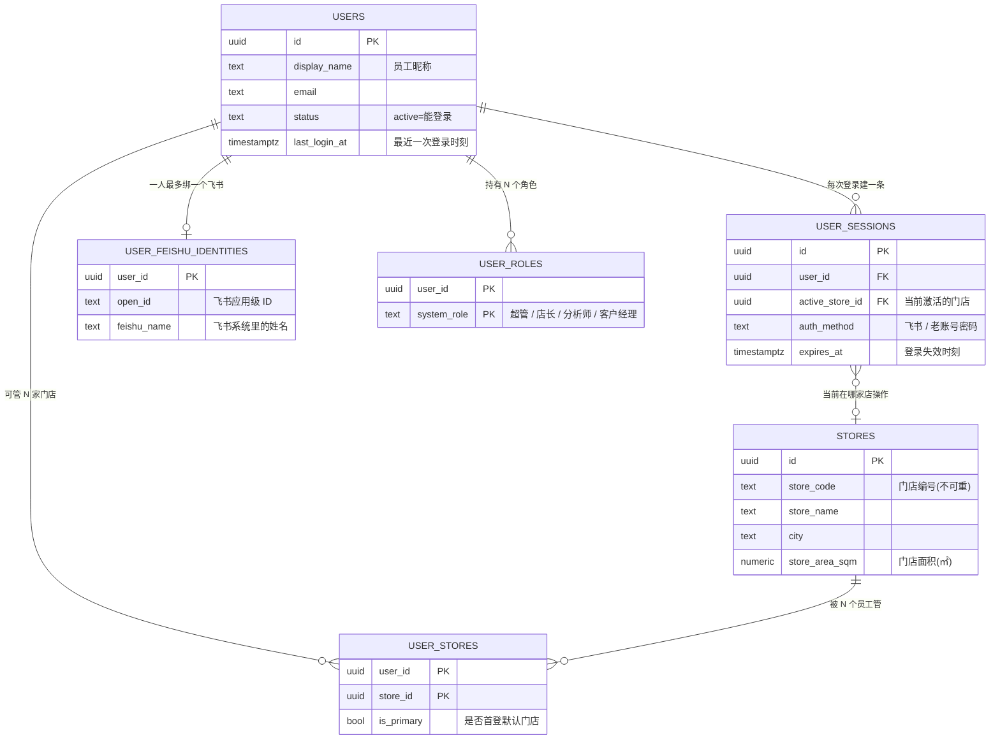
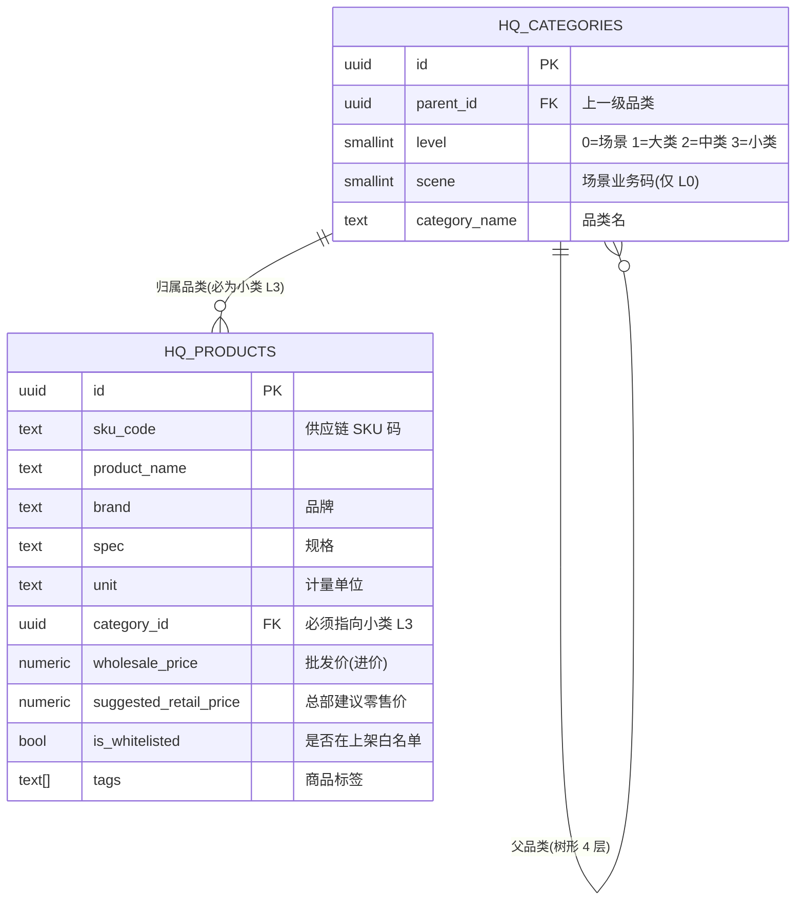
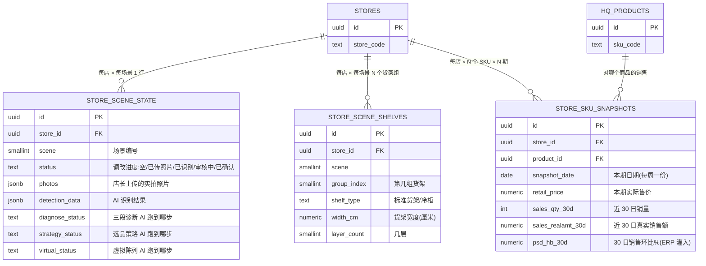
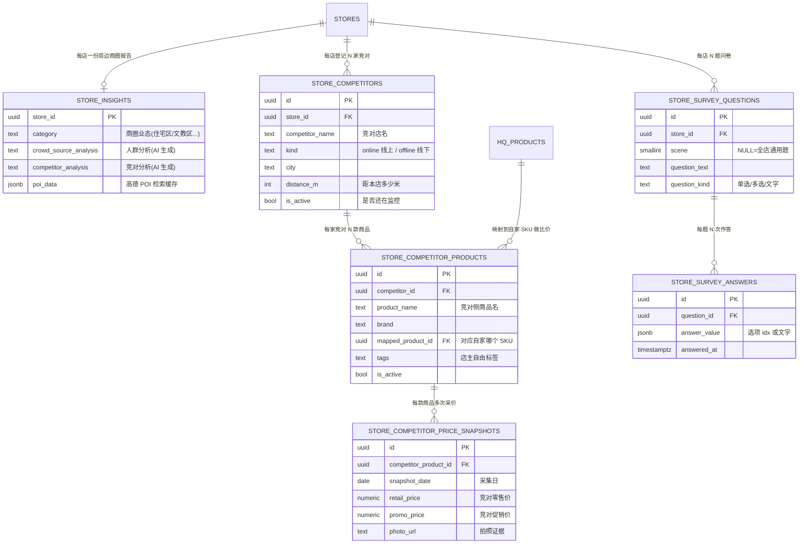
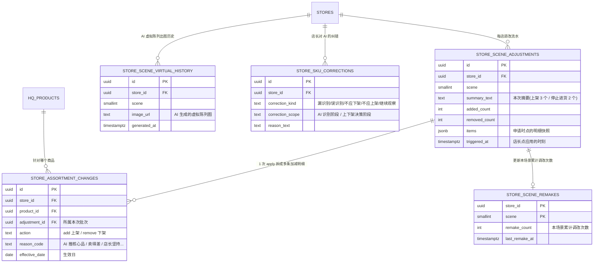
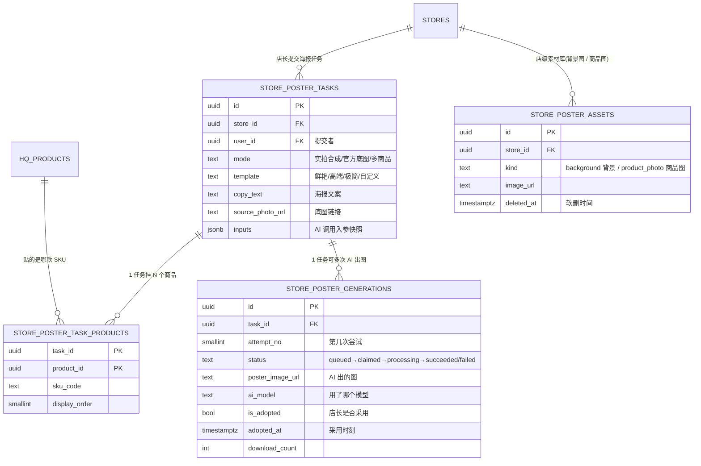

# 数据库结构文档

> 给新加入项目的开发：每张表 / 每个字段是什么、什么时候被读、什么时候被写。优先用业务语言（不照搬 SQL 注释）。
>
> 数据源：
> - 迁移文件：[apps/api/src/db/migrations/](../apps/api/src/db/migrations/) — V001 到 **V038**（最新：[V038__upload_kind_stores.sql](../apps/api/src/db/migrations/V038__upload_kind_stores.sql)）
> - 视图：[V010__views.sql](../apps/api/src/db/migrations/V010__views.sql)（V029 把促销视图 `v_promotion_active` 删掉，换成新视图 `v_active_offers`）
> - SQL 函数：[V012__category_functions.sql](../apps/api/src/db/migrations/V012__category_functions.sql) + [V023 `fn_category_ancestor_name`](../apps/api/src/db/migrations/V023__category_ancestor_name_fn.sql)
> - V013 后的 prune：[V013__prune_unused_columns.sql](../apps/api/src/db/migrations/V013__prune_unused_columns.sql)
> - 字段 → 接口形态：见 [data-flow.md](./data-flow.md)
> - 字段 → HTTP 契约：见 [api-contracts.md](./api-contracts.md)
> - 字段 → 前端状态：见 [state-management.md](./state-management.md)
>
> **schema 演进记录（V014+）**：V014 删 `store_ownership` / 砍 `stores.district`；V015 缩瘦 `store_insights` + 加 POI 缓存列；V016 加 `stores.store_area_sqm` / `poi_category`；V017 加 `hq_products.barcode` / `is_returnable` / `allocation_unit`；V018 物理尺寸 mm → cm；V019 锁 `hq_products.category_id` 必须 L3 + 触发器；V020 `hq_promo_mix_groups` 表 → VIEW（V029 起整体作废）；V021 删 `hq_promo_sku_texts`；V022 烘焙 unit + L3 修正；V023 加 `fn_category_ancestor_name`；V024 `hq_benchmark_skus` → `hq_whitelist`（中间态）；V025 白名单合并为 `hq_products.is_whitelisted` 列 + 拆表；V026 加 `tags` / `market_min_price` / `market_min_price_source`；**V027** `store_sku_snapshots` 删 `original_price` / `wholesale_price`（只保留实际售价 `retail_price`）+ 价盘曲线改 snapshot 单源 + `store_price_changes` 读写路径废弃（表保留）+ 前端"调价"语义改为"模拟调价"；**V028** `store_scene_state` 加 4 个字段，让"诊断 / 选品"两个 AI 工作流也走后端常驻、关 tab 不丢；**V029 促销数据整体重构** —— 老促销表 / 视图全删，重建为「批次 + 档案行 + 标准化优惠」三层（含 5 个 sheet 的活动类别、4 类优惠机制），上传语义改为"新文件入库即把所有旧批次自动作废，同一时刻只有一份生效"；**V030** 把"今天是否在生效星期内"这一步从数据库视图里摘掉，交给前端按"今明"开关自己决定；**V031** `store_sku_snapshots` 销售指标对齐 ERP 真实口径 —— `sales_amount_*` → `sales_realamt_*`、新增 `psd_hb_30d/90d`(销售环比 %, ERP 直接灌入)、删 `gross_margin_30d`(不再导毛利率;UI"月毛利" KPI 一并下线)；传给智能体的 `psdChangetb` 改名为 `psdChange`(值来自 `psd_hb_30d`);`store_competitor_products` 加 `tags TEXT`(店主自由标签)。
>
> **V032+ 演进**：
>
> **V032** 海报生图模型 setting 切到 Corelays(`/proxy/openai/v1`, `gemini-3.1-pro-preview`)，从 OpenRouter `google/gemini-2.5-flash-image` 迁出；只改 `sys_settings` 的 `poster_image_model` 行，无 schema 变更。**V033** 紧接着改回 `gemini-3.1-flash-image`(`pro-preview` 在 Corelays 订阅里不存在 → 切到实际可用的 flash 走 Gemini 原生 generateContent)。**V034** `store_poster_task_products` 锚点放宽：PK 从 `(task_id, product_id)` 改为 `(task_id, sku_code)`，`product_id` `DROP NOT NULL`，未入库 `hq_products` 的 SKU 也能建任务出图(仅丢失销量追踪;`v_poster_product_sales` 视图 LATERAL JOIN 用 `product_id IS NULL` 时空匹配,等价兼容)。**V035 海报收藏** —— 新增 `store_poster_favorites` 表(`user_id` + `generation_id` UNIQUE),用户主动收藏 generation;区别于「生成记录」=  `store_poster_tasks` 全量(自动 30 天)。同时下线旧 `sessionHistory` / `recent` 两套 localStorage 持久(关 tab/换设备会丢)。**V036 admin-web 数据上传批次表** —— 新增 `upload_batches` 表 + 两个 enum `upload_kind('promotions','products','snapshots')` / `upload_status('staged','applied','failed','rolled_back')`,三类上传共用一张表;`staging_data jsonb` 存解析成功的行,`parse_errors jsonb` 存前 200 条行级错误,`apply_summary jsonb` 在 apply 后记录 `{inserted, updated, skipped}`。**V037** 给 `upload_batches` 加 `before_snapshot jsonb DEFAULT '[]'` —— apply 阶段把会被覆盖的字段值快照下来,rollback 时逐条还原;数组元素分两种 `{kind:'inserted'|'updated', table, key, before?}`。**V038** `upload_kind` enum 增加 `'stores'`,配合 admin-web「数据维护 / 门店信息」综合页:既能 CSV 批量上传新增/覆盖门店,也能逐家在 UI 上增/改/删(走 `admin-stores.service.ts`,跟 batch apply 写同一张 `stores` 表)。

---

## 目录

- [0. ENUM 类型字典](#0--enum-类型字典)
- [1. 身份 / 会话 / 权限](#1--身份--会话--权限-v002)
- [2. 系统横切 / 全局设置](#2--系统横切--全局设置-v003--v011)
- [3. 总部主数据](#3--总部主数据-v004--v012)
- [4. 促销](#4--促销-v005)
- [5. 门店现状](#5--门店现状-v006)
- [6. 门店洞察 / 竞品 / 问卷](#6--门店洞察--竞品--问卷-v007)
- [7. 门店动作](#7--门店动作-v008)
- [8. 海报](#8--海报-v009)
- [9. 视图](#9--视图-v010)
- [10. SQL 函数](#10--sql-函数-v012)
- [11. 跨表才讲得清的业务规则](#11--跨表才讲得清的业务规则)
- [12. 业务动作 → 表写入路径速查表](#12--业务动作--表写入路径速查表)
- [13. "我想知道 X 该查哪"速查表](#13-我想知道-x-该查哪速查表)

---

## 业务域索引

| 业务域 | 涉及表 | 主要 service |
|---|---|---|
| 身份 / 权限 | users, user_sessions, user_roles, user_stores, user_feishu_identities, stores | auth, portal, admin-accounts, feishu-identity |
| 系统横切 | sys_audit_events, sys_usage_sessions, sys_settings | audit, admin-stats |
| 总部主数据 | hq_categories, hq_products | hq, ai-shelves (Dify whitelist via hq_products.is_whitelisted) |
| 促销 | hq_promo_batches, hq_promo_raw_items, hq_promo_offers（V029 起；旧的 batch_items / mix_groups 已删） | promotions |
| 门店现状 | store_scene_state, store_scene_shelves, store_sku_snapshots | scene, store-skus |
| 门店洞察 | store_insights, store_competitors, store_competitor_products, store_competitor_price_snapshots, store_survey_questions, store_survey_answers | competitors, surveys |
| 门店动作 | store_scene_adjustments, store_assortment_changes, store_scene_remakes, store_scene_virtual_history, store_sku_corrections, store_price_changes | scene, prices, ai-shelves |
| 海报 | store_poster_tasks, store_poster_task_products, store_poster_generations, store_poster_assets | posters |

---

## 全局 ER 总览图

> 把所有 30+ 张表的相互连接放在一张图里,只画表名 + 关系不展开字段。看清"全系统都有哪些表、它们怎么互相挂钩"用这张;具体每张表存什么内容,看分域 ER 图(在 §1 / §3 / §4 / §5 / §6 / §7 / §8 章节开头)。
>
> **三个核心枢纽**(图里出度最高的实体):
> - **USERS** —— 谁登录、谁干了什么动作的源头
> - **STORES** —— 几乎所有"门店相关"的表都挂在它下面(销售快照 / 调改 / 海报 / 竞品 / 洞察 ...)
> - **HQ_PRODUCTS** —— 任何"针对某个 SKU"的数据(销量、促销 offer、海报、调改、竞品比价)都通过它做关联

```mermaid
erDiagram
    %% ===== 身份 / 会话 / 权限 =====
    USERS ||--o{ USER_SESSIONS : "每次登录建一条"
    USERS ||--o| USER_FEISHU_IDENTITIES : "飞书绑定"
    USERS ||--o{ USER_ROLES : "持有 N 个角色"
    USERS ||--o{ USER_STORES : "可管 N 家门店"
    STORES ||--o{ USER_STORES : "被 N 个员工管"
    USER_SESSIONS }o--o| STORES : "当前激活门店"

    %% ===== 系统横切 =====
    USER_SESSIONS ||--o{ SYS_USAGE_SESSIONS : "切片记录使用时长"
    USERS ||..o{ SYS_AUDIT_EVENTS : "动作来自哪个员工(软引用,无 FK)"
    STORES ||..o{ SYS_AUDIT_EVENTS : "涉及哪家店(软引用)"

    %% ===== 总部主数据 =====
    HQ_CATEGORIES ||--o{ HQ_CATEGORIES : "父品类(自引用)"
    HQ_CATEGORIES ||--o{ HQ_PRODUCTS : "归属小类"

    %% ===== 促销 =====
    USERS ||--o{ HQ_PROMO_BATCHES : "总部账号上传"
    HQ_PROMO_BATCHES ||--o{ HQ_PROMO_RAW_ITEMS : "Excel 每行落档"
    HQ_PROMO_BATCHES ||--o{ HQ_PROMO_OFFERS : "标准化优惠"
    HQ_PROMO_RAW_ITEMS ||--o{ HQ_PROMO_OFFERS : "档案行翻译成 offer"

    %% ===== 门店现状 =====
    STORES ||--o{ STORE_SCENE_STATE : "每店每场景一行"
    STORES ||--o{ STORE_SCENE_SHELVES : "货架组"
    STORES ||--o{ STORE_SKU_SNAPSHOTS : "每周销售快照"
    HQ_PRODUCTS ||--o{ STORE_SKU_SNAPSHOTS : "对哪款 SKU"
    USERS ||--o{ STORE_SKU_SNAPSHOTS : "谁导入的"

    %% ===== 洞察 / 竞品 / 问卷 =====
    STORES ||--o| STORE_INSIGHTS : "周边商圈报告"
    STORES ||--o{ STORE_COMPETITORS : "登记竞对店"
    STORE_COMPETITORS ||--o{ STORE_COMPETITOR_PRODUCTS : "竞对商品"
    STORE_COMPETITOR_PRODUCTS ||--o{ STORE_COMPETITOR_PRICE_SNAPSHOTS : "采价"
    HQ_PRODUCTS ||--o{ STORE_COMPETITOR_PRODUCTS : "映射比价"
    STORES ||--o{ STORE_SURVEY_QUESTIONS : "每店问卷"
    STORE_SURVEY_QUESTIONS ||--o{ STORE_SURVEY_ANSWERS : "店长回答"
    USERS ||--o{ STORE_SURVEY_ANSWERS : "谁答的"
    USERS ||--o{ STORE_COMPETITOR_PRICE_SNAPSHOTS : "谁采的"

    %% ===== 门店动作 =====
    STORES ||--o{ STORE_SCENE_ADJUSTMENTS : "调改批次"
    USERS ||--o{ STORE_SCENE_ADJUSTMENTS : "谁触发的"
    STORE_SCENE_ADJUSTMENTS ||--o{ STORE_ASSORTMENT_CHANGES : "拆成加减明细"
    STORE_SCENE_ADJUSTMENTS ||--o| STORE_SCENE_REMAKES : "更新计数"
    HQ_PRODUCTS ||--o{ STORE_ASSORTMENT_CHANGES : "针对哪款 SKU"
    STORES ||--o{ STORE_SCENE_VIRTUAL_HISTORY : "虚拟陈列出图历史"
    STORES ||--o{ STORE_SKU_CORRECTIONS : "对 AI 的纠错"
    HQ_PRODUCTS ||--o{ STORE_SKU_CORRECTIONS : "哪款 SKU"
    STORES ||--o{ STORE_PRICE_CHANGES : "调价历史(V027 起读写废弃)"

    %% ===== 海报 =====
    STORES ||--o{ STORE_POSTER_TASKS : "店长提交任务"
    USERS ||--o{ STORE_POSTER_TASKS : "提交者"
    STORE_POSTER_TASKS ||--o{ STORE_POSTER_TASK_PRODUCTS : "任务包含 N 个商品"
    STORE_POSTER_TASKS ||--o{ STORE_POSTER_GENERATIONS : "1 任务可多次出图"
    HQ_PRODUCTS ||--o{ STORE_POSTER_TASK_PRODUCTS : "贴哪款 SKU"
    STORES ||--o{ STORE_POSTER_ASSETS : "店级素材库"
    USERS ||--o{ STORE_POSTER_ASSETS : "谁上传的"

    USERS {
        uuid id PK
    }
    USER_SESSIONS {
        uuid id PK
    }
    USER_ROLES {
        uuid user_id PK
    }
    USER_STORES {
        uuid user_id PK
    }
    USER_FEISHU_IDENTITIES {
        uuid user_id PK
    }
    STORES {
        uuid id PK
    }
    SYS_AUDIT_EVENTS {
        uuid id PK
    }
    SYS_USAGE_SESSIONS {
        uuid id PK
    }
    HQ_CATEGORIES {
        uuid id PK
    }
    HQ_PRODUCTS {
        uuid id PK
    }
    HQ_PROMO_BATCHES {
        uuid id PK
    }
    HQ_PROMO_RAW_ITEMS {
        uuid id PK
    }
    HQ_PROMO_OFFERS {
        uuid id PK
    }
    STORE_SCENE_STATE {
        uuid id PK
    }
    STORE_SCENE_SHELVES {
        uuid id PK
    }
    STORE_SKU_SNAPSHOTS {
        uuid id PK
    }
    STORE_INSIGHTS {
        uuid store_id PK
    }
    STORE_COMPETITORS {
        uuid id PK
    }
    STORE_COMPETITOR_PRODUCTS {
        uuid id PK
    }
    STORE_COMPETITOR_PRICE_SNAPSHOTS {
        uuid id PK
    }
    STORE_SURVEY_QUESTIONS {
        uuid id PK
    }
    STORE_SURVEY_ANSWERS {
        uuid id PK
    }
    STORE_SCENE_ADJUSTMENTS {
        uuid id PK
    }
    STORE_ASSORTMENT_CHANGES {
        uuid id PK
    }
    STORE_SCENE_REMAKES {
        uuid store_id PK
    }
    STORE_SCENE_VIRTUAL_HISTORY {
        uuid id PK
    }
    STORE_SKU_CORRECTIONS {
        uuid id PK
    }
    STORE_PRICE_CHANGES {
        uuid id PK
    }
    STORE_POSTER_TASKS {
        uuid id PK
    }
    STORE_POSTER_TASK_PRODUCTS {
        uuid task_id PK
    }
    STORE_POSTER_GENERATIONS {
        uuid id PK
    }
    STORE_POSTER_ASSETS {
        uuid id PK
    }
```



**关系符号速查**:
- `||--o{` = 一对多(左边一行对应右边多行)
- `||--o|` = 一对零或一
- `}o--o|` = 多对零或一
- `||..o{` = 软引用,**没设外键约束**(典型例子:`sys_audit_events` 里"哪个员工/哪家店"是事件发生时刻的快照,即使该员工后来被删,审计记录仍然可读)

**注意**:`sys_settings` 是全局配置表,跟任何业务实体都不直接挂钩,不画进图里(独立存在)。`store_price_changes` V027 起读写路径全部废弃,关系画在图里只为标记历史存在。

---

## 0 · ENUM 类型字典

> 全部定义在 [V001__extensions_and_enums.sql](../apps/api/src/db/migrations/V001__extensions_and_enums.sql)。`audit_event_kind` 在 V013 删了 `price_ai_diagnose`、`price_change_source` 在 V013 删了 `ai_suggest`。

### 身份 / 权限

| 类型 | 取值 | 业务含义 |
|---|---|---|
| `user_status` | `active` / `disabled` | 这个账号现在还能不能登录（active=能，disabled=不能；后台拉黑用） |
| `system_role` | `super_admin` / `store_owner` / `analyst` / `account_manager` | 系统角色；决定能访问哪些模块 |
| `auth_method` | `feishu_qr` / `feishu_h5` / `legacy_password` | 登录方式；legacy_password 是公司全员迁飞书前的老账号密码登录，逐步退役中 |
| `client_type` | `feishu_h5` / `feishu_pc` / `browser` | 登录端（飞书 H5 / 飞书 PC / 浏览器） |
| `usage_session_status` | `active` / `ended` / `timeout` | 这次打开 app 的会话状态；90 秒没动作系统就当用户已经离开（timeout），用来算"实际在用 app 的人数" |

### 系统横切

| 类型 | 取值 | 业务含义 |
|---|---|---|
| `setting_value_type` | `string` / `int` / `float` / `bool` / `json` | 后台运营改设置时，告诉前端 UI 该用输入框/勾选框/JSON 编辑器的哪种 |
| `audit_event_kind` | 见下面"审计事件全集" | 全系统所有"谁做了什么"流水里，这次动作是哪一类（登录/上传促销/采用海报...） |

**审计事件全集**（按业务域分组）：

- **认证**：`user_login`, `user_logout`, `user_session_refresh`, `feishu_oauth_success`, `feishu_oauth_fail`
- **账号**：`user_create`, `user_update`, `user_disable`, `user_delete`, `user_password_reset`, `user_role_change`, `user_store_bind`, `user_store_unbind`
- **门店**：`store_create`, `store_update`
- **导入**：`sku_import`
- **促销**：`promotion_batch_upload`, `promotion_batch_activate`, `promotion_batch_delete`
- **选品**：`scene_config_change`, `scene_photo_upload`, `scene_detect`, `scene_qa_submit`, `scene_env_update`, `scene_ai_diagnose`, `scene_ai_strategy`, `scene_assortment_apply`, `scene_virtual_generate`, `sku_correction_submit`
- **洞察**：`survey_submit`, `insight_generate`, `store_insight_update`
- **价盘**：`price_change`
- **海报**：`poster_task_submit`, `poster_generation_complete`, `poster_generation_fail`, `poster_adopt`, `poster_download`, `poster_asset_upload`, `poster_asset_delete`
- **竞品**：`competitor_update`, `competitor_product_update`, `competitor_price_collect`
- **系统**：`super_admin_action`, `app_setting_change`, `ai_model_switch`, `ai_stress_test`

### 总部主数据

| 类型 | 取值 | 业务含义 |
|---|---|---|
| `product_status` | `active` / `delisted` | 商品是否在售 |
| ~~`benchmark_segment`~~ | ~~`core` / `innovation`~~ | **已删除（V024 起；V025 把白名单进一步合并为 `hq_products.is_whitelisted` 列）** |
| ~~`store_ownership`~~ | ~~`direct` / `franchise`~~ | **已删除（V014 起）** |
| `promotion_scope` | `all_stores` / `city` / `store_list` | 一条选品建议文案是给哪些店看的：全部门店 / 某个城市 / 指定门店列表 |

### 促销（V029 新增）

| 类型 | 取值 | 业务含义 |
|---|---|---|
| `promo_activity_type` | `member_price` / `weekend_beer` / `brand_coupon` / `tuesday_member` / `regular_coupon` | 促销 Excel 里 5 个 sheet 的活动类别：会员价 / 周末啤酒日 / 品牌满减券 / 周二会员日 / 常规优惠券 |
| `promo_mechanic` | `flat_price` / `bundle_price` / `percent_discount` / `pool_threshold` | 一条优惠"怎么算钱"的 4 种机制：单件特价 / 几件总价 / 百分比折扣（如会员 9 折）/ 整盘满减（如品牌满 88 减 10）。覆盖实测 14 种文案话术 |

### 门店现状 + 动作

| 类型 | 取值 | 业务含义 |
|---|---|---|
| `scene_state_status` | `empty` / `photo_uploaded` / `detected` / `reviewing` / `confirmed` | 店长调改一个场景货架的进度：还没上传照片 → 已传照片 → AI 识别完了 → 店长正在逐条确认 → 已应用 |
| `scene_virtual_status` | `idle` / `processing` / `completed` / `failed` | AI 帮店长画"调改后货架长啥样"的预览图，当前跑到哪步：还没开始 / 在跑 / 已完成 / 失败 |
| `assortment_action` | `add` / `remove` | 调改动作（上架 / 下架） |
| `assortment_reason` | `ai_recommend_core` / `ai_recommend_innovation` / `low_sales` / `competitor_replace` / `shelf_space_limit` / `manual_keep` / `manual_remove` / `other` | 为什么决定上/下架（AI 推核心品 / AI 推新品 / 卖得差 / 被竞品抢 / 位置不够 / 店长坚持留 / 店长坚持下 / 其他） |
| `price_change_source` | `manual` / `rule_engine` | 这次价格变动是哪种触发：店长手动 / 系统规则自动（V013 删除了 `ai_suggest`） |
| `sku_correction_kind` | `missed` / `false_positive` / `add` / `remove` / `observe` | 店长在哪一步点了"不对"按钮：AI 识别阶段（漏识别/错识别）或 上下架决策阶段（不应该下/不应该上/继续观察） |
| `sku_correction_scope` | `detection` / `decision` | 这次纠错是在哪一步发生的：AI 看货架照片识别 SKU 时 / 店长决策上下架时 |
| `competitor_kind` | `online` / `offline` | 这家竞争对手是线上店（美团/京东到家）还是线下店 |

### 海报

| 类型 | 取值 | 业务含义 |
|---|---|---|
| `poster_mode` | `photo_compose` / `official_bg_only` / `multi_product` | 店长这次做海报的玩法：把商品图贴进店内场景照片 / 用官方背景图 / 多个商品拼一张 |
| `poster_template` | `vibrant` / `premium` / `minimal` / `custom` | 海报模板风格 |
| `poster_generation_status` | `queued` / `claimed` / `processing` / `succeeded` / `failed` / `canceled` | AI 出海报这次跑到哪一步：排队中 → worker 认领 → 正在生成 → 成功 / 失败 / 已取消 |

---

## 1 · 身份 / 会话 / 权限 (V002)

### ER 图:谁能登录、登录后绑哪家店



> 怎么读这张图:一个员工(USERS)可以同时管多家门店(USER_STORES),每次他打开 app 登录就开一条 USER_SESSIONS,在里面记下"他现在站在哪家店里办事"(active_store_id)—— 这就是后续所有"本店"操作的依据。USER_FEISHU_IDENTITIES 是公司迁飞书后每个员工的飞书"身份证",USER_ROLES 决定他能进哪些模块。

### `users`

> 能登录系统的人：店长、运营、分析师、超级管理员。[V002.sql](../apps/api/src/db/migrations/V002__identity_org.sql)

| 字段 | 类型 | 业务含义 | 谁写 | 谁读 |
|---|---|---|---|---|
| id | UUID PK | 用户唯一标识 | 店员第一次扫飞书 QR 登录时自动建一行；超管在后台手工建账号时也建 | 所有认证 / 权限校验都通过此键 |
| display_name | TEXT NOT NULL | 用户昵称（界面展示）；飞书优先取飞书名 | 店长账密登录或飞书登录时，系统自动从飞书拉名字写进来；后台手工建账号时手填 | 前端右上角"你好，XX"展示名；后台账号列表 |
| email | TEXT | 邮箱；如果用户走飞书登录，就用飞书账号上挂的邮箱；后台手工建号时手填 | 用户第一次飞书登录（或之后每次登录刷新）时，从飞书拉过来；后台手工建号时也可填 | 前端登录后展示用 |
| avatar_url | TEXT | 头像 URL | 用户飞书登录时拉过来；后台手工建号也能填 | 前端登录后展示用 |
| phone | TEXT | 手机号；目前只用于后台展示，没接验证码/通知 | 后台创建 | 后台展示 |
| legacy_account | TEXT UNIQUE (partial, deleted_at IS NULL) | 公司全员迁飞书前的旧账号（店长可用账号密码登录）；新员工不会再有，等老员工全迁完会彻底删掉这一列 | 后台手工建号 | 店长用账号密码登录时按这个查；飞书登录时如果飞书账号还没绑，会先按这个登录方式找老账号 |
| legacy_password_hash | TEXT | 密码哈希（bcrypt 加密存，看不到明文） | 超管在后台点"重置密码"时写入 | 店长账密登录时和输入的密码做比对 |
| status | user_status NOT NULL, DEFAULT 'active' | 启用状态（disabled = 不能登录 + 会话失效） | 超管在后台点"启用/停用账号"时写入 | 每次用户发请求都会先看这个，disabled 的人哪都进不去 |
| last_login_at | TIMESTAMPTZ | 最后登录时刻 | 每次用户登录成功后系统更新 | 后台展示；识别僵尸账号 |
| created_at / updated_at | TIMESTAMPTZ | 时间戳 | DB | 排序 / 审计 |
| deleted_at | TIMESTAMPTZ | 账号是不是被后台删了；删了之后这一行仍留着只是看不到，因为审计要追溯历史 | 超管在后台点"删除账号"时写入 | 所有读账号的地方都会自动过滤掉已删的 |

**约束亮点**：唯一性只看活的账号 —— 同一个账号被后台删了之后，允许新员工再用这个邮箱/账号名注册（数据库做法：partial UNIQUE 仅约束 deleted_at IS NULL 的行）。

**触发动作**：店长一登录，系统就同时干三件事：更新本表的"最后登录时间"，在会话表开一张新会话，在审计流水里记一条"用户登录"事件。

---

### `user_sessions`

> 用户登录会话。记录在哪家店、何时过期。[V002.sql](../apps/api/src/db/migrations/V002__identity_org.sql)

| 字段 | 类型 | 业务含义 | 谁写 | 谁读 |
|---|---|---|---|---|
| id | UUID PK | 会话唯一标识 | DB | sys_usage_sessions.auth_session_id FK |
| user_id | UUID FK(users) NOT NULL | 会话所属用户 | 用户登录时新建会话那一刻 | 前端每次发请求，系统从通行证查出"这是哪个用户" |
| token_hash | TEXT NOT NULL UNIQUE | 登录后系统发给前端的"通行证"的加密指纹；原文不存数据库，防数据库泄露就被人冒充登录 | 用户登录成功、系统发通行证的时候 | 前端发请求时带通行证，系统把通行证加密一下，按指纹找到对应会话 |
| auth_method | auth_method NOT NULL | 登录方式 | INSERT | 后台审计 |
| client_type | client_type NOT NULL, DEFAULT 'browser' | 登录端（飞书 PC / 飞书 H5 / 浏览器） | INSERT | 后台审计 |
| **active_store_id** | UUID FK(stores) | **当前激活的门店**；NULL = 未选店 | 店长在 app 里点"切换门店"按钮时（全系统只有这一个地方能改它） | 每个请求进来时，系统读出当前会话选中的门店，后续所有业务（看促销/做海报/选品）都自动只看这家店 |
| user_agent / ip | TEXT / INET | 客户端标识 + IP | INSERT | 审计 / 安全 |
| issued_at | TIMESTAMPTZ NOT NULL | 颁发时刻 | DB | — |
| last_seen_at | TIMESTAMPTZ NOT NULL | 用户最近一次发请求的时间，超过 5 分钟没动就算下线 | 用户每次发请求，系统在后台静默更新这个时间 | 后台"实时在线"数字：近 5 分钟有动作的用户都算在线 |
| expires_at | TIMESTAMPTZ NOT NULL | 过期时刻 | 登录那一刻自动写入，= 当前时间 + 设置里配的"会话有效期"（默认 2 小时） | 用户发请求时，先看会话有没有过期；过期就让他重新登录 |
| revoked_at | TIMESTAMPTZ | 撤销时刻 | 用户点登出 / 超管把他踢下线时写入 | 用户发请求时，先看会话有没有被撤销（登出/被踢）；撤销的就拒绝 |

**约束亮点**：刚登录但还没选店时，`active_store_id` 是空的；全系统只有"切换门店" API 这一个地方能改它（设计决策 D11）。

**触发动作**：登录 → 开一张新会话；切店 → 更新会话上的"当前门店"；登出 → 标记会话已撤销；每次发请求 → 后台静默更新"最后活跃时间"。

---

### `user_roles`

> 用户 ↔ 系统角色多对多。一个用户可有多个角色。[V002.sql](../apps/api/src/db/migrations/V002__identity_org.sql)

| 字段 | 类型 | 业务含义 | 谁写 | 谁读 |
|---|---|---|---|---|
| user_id, system_role | 复合 PK | 用户 + 角色 | 飞书登录时，系统读取该员工的飞书部门，自动判出角色（超管/店长）；后台超管也能在账号页手工改角色 | 每次请求校验权限；首页根据角色决定显示哪些模块入口 |
| granted_at | TIMESTAMPTZ | 赋予时刻 | DB | 审计 |
| granted_by | UUID FK(users) | 谁赋的（飞书自动赋时 NULL） | INSERT | 审计 |

**触发动作**：员工每次飞书登录，系统就根据飞书部门重新算一遍角色（算法：在"管理员"部门里 → 超管；在门店部门里 → 店长）；超管在后台改角色是"整盘换" —— 把这个人原有的角色全删，再按新选中的集合重新写入。

---

### `user_stores`

> 用户 ↔ 门店多对多。一人可管多店、一店可多人管。[V002.sql](../apps/api/src/db/migrations/V002__identity_org.sql)

| 字段 | 类型 | 业务含义 | 谁写 | 谁读 |
|---|---|---|---|---|
| user_id, store_id | 复合 PK | 绑定关系 | 员工飞书登录时，如果飞书里挂了他属于哪家门店，就追加这条绑定关系（只加不减）；后台超管手工改门店绑定是"整盘换"（原来绑的全清，按新选中的重新写） | 用户进入选店页时，非超管只能看到他自己绑定的门店列表 |
| is_primary | BOOLEAN | 标记是不是这个人首登时第一家绑定的店；只用于多店列表里排个序，实际"当前在看哪家店"看会话表 | INSERT | portal 排序优先 |
| assigned_at / assigned_by | TIMESTAMPTZ / UUID | 时间 + 操作者 | INSERT | 审计 |

**设计决策 D1**：super_admin 不需要在 user_stores 有记录就能看到所有门店（`auth.loadVisibleStores()` 走特殊分支）。

---

### `user_feishu_identities`

> 用户 ↔ 飞书身份一对一绑定。[V002.sql](../apps/api/src/db/migrations/V002__identity_org.sql)

| 字段 | 类型 | 业务含义 | 谁写 | 谁读 |
|---|---|---|---|---|
| id | UUID PK | 表 PK | DB | — |
| user_id | UUID FK(users) UNIQUE | 绑定的用户（UNIQUE：一用户一飞书） | 首次飞书登录绑定时写入 | 每次飞书登录时，根据飞书返回的 open_id 查出这是咱们系统里的哪个员工 |
| open_id | TEXT NOT NULL UNIQUE | 飞书发的"用户在咱们这个 app 里的稳定 ID"；一个员工就一个，不会变 | 每次登录刷新 | 主要查找键 |
| union_id | TEXT | 飞书发的"用户在咱整个公司账号体系里的 ID"；open_id 找不到时拿这个兜底 | 每次登录刷新 | open_id 找不到时 fallback |
| tenant_key | TEXT | 飞书租户标识（预留） | INSERT | — |
| feishu_email / feishu_mobile / feishu_name / feishu_avatar_url | TEXT | 飞书系统里这员工挂着的邮箱/手机/姓名/头像，登录时拍下来存一份；万一上面 users 表里被改空了，这里能兜底 | 每次登录刷新 | users.* 字段的兜底来源 |
| access_token | TEXT | 飞书 access_token | 每次登录刷新 | 后续如需调飞书 API |
| refresh_token | TEXT | refresh_token（暂未使用） | — | — |
| token_expires_at | TIMESTAMPTZ | access_token 过期时刻 | INSERT 计算 | 主动刷新对标 |
| bound_at / last_synced_at | TIMESTAMPTZ | 首绑时刻 / 最近同步 | INSERT / UPDATE | 运维诊断 |

**设计决策 D2**：飞书登录时按"open_id → union_id → email"三档兜底找老账号；过渡期里有些员工先有 legacy 账号、后才用飞书登录，要靠 email 桥接绑上。

---

### `stores`

> 美宜佳门店档案。[V002.sql](../apps/api/src/db/migrations/V002__identity_org.sql)

| 字段 | 类型 | 业务含义 | 谁写 | 谁读 |
|---|---|---|---|---|
| id | UUID PK | 门店唯一标识 | DB | 所有"哪家店做了什么"的记录都靠这个 ID 关联回门店 |
| store_code | VARCHAR(32) NOT NULL UNIQUE | 门店编号（美宜佳供应链统一编号）；一旦后台把店删了，这个编号也不能再给新店复用 | 手工 / 数据导入 | 飞书登录时，如果飞书部门名等于门店编号，系统就自动把这员工绑给这家店 |
| store_name | TEXT NOT NULL | 门店名 | 创建时 | 前端展示 |
| province / city / address | TEXT | 门店地址；查"周边商圈"会拿 city 去问高德地图找附近 POI，所以 city 必填 | 创建时 | portal 返回前端；选品周边商圈 |
| latitude / longitude | NUMERIC(9,6) | GPS 坐标；返回前端时转 number | 创建时 | portal 返回 |
| opened_at | DATE | 开业日期 | 创建时 | 运营统计 |
| is_project_store | BOOLEAN NOT NULL, DEFAULT false | 是不是"项目试点店"；这个标记只是给前端 UI 打个小角标，不影响该店的任何权限/可见性 | 创建时 / 后台改 | 前端 UI 标记 |
| **store_area_sqm** | NUMERIC(6,2) | **V016 新增** · 门店面积（㎡）；可空 | 创建时 / 后台改 | Dify 选品 inputs · 报告展示 |
| **poi_category** | TEXT | **V016 新增** · 门店商圈类型标签（HQ 主数据；区别于 `store_insights.category` 的 AI 分析输出） | 创建时 / 后台改 | Dify 选品 inputs · 报告展示 |
| status | user_status NOT NULL, DEFAULT 'active' | 启用状态（disabled = 不能进） | INSERT 默认 / 后台改 | 所有查询过滤 |
| created_at / updated_at / deleted_at | TIMESTAMPTZ | 时间戳 + 软删 | DB | 列表排序 / 过滤 |

---

## 2 · 系统横切 / 全局设置 (V003 / V011)

### `sys_audit_events`

> 全系统所有"谁做了什么"的流水账；只能追加、不能改、不能删，出问题时用来回溯。[V003.sql](../apps/api/src/db/migrations/V003__sys_crosscutting.sql)

| 字段 | 类型 | 业务含义 | 谁写 | 谁读 |
|---|---|---|---|---|
| id | UUID PK | 事件 ID | DB | 排序 |
| event_kind | audit_event_kind NOT NULL | 48+ 种操作类型 | 所有写操作完成后，业务代码统一调审计服务记一条 | `admin-stats.listAuditEvents()` 按 kind 筛 |
| actor_user_id | UUID（**无 FK**） | 做这件事的是谁；故意不连用户表外键，这样就算这人后来被删了，审计流水里还能看到他当时的身份 | req.user.id 赋值 | 后台审计查询 |
| actor_role / actor_display_name | TEXT（**快照**） | 操作那一刻这人的角色和姓名拍下来存一份；万一以后他改名/换角色，审计里还是当时那个身份，不会被冲掉 | INSERT | 审计展示 |
| target_store_id / target_store_label | UUID / TEXT | 这件事关于哪家店，门店编号也拍照存一份；万一这家店后来被删了，审计里还能看到当时是哪家 | 写入审计的业务代码按当前操作的门店填 | 按店筛选 |
| target_type / target_id | TEXT | 这件事的对象是什么（账号/促销批次/海报...）以及它的 ID；追溯"这个对象历史都被谁动过" | 写入审计的业务代码按操作对象填 | 追踪某对象 |
| summary | TEXT | 人话摘要（'用户登录'） | 写入审计的业务代码按当前动作填一句话 | 审计列表 |
| payload | JSONB NOT NULL, DEFAULT '{}' | 详细 JSON（新旧值对比、AI prompt 等） | 写入审计的业务代码按当前动作填 | 详情查看 / 分析 |
| is_ai_call | BOOLEAN NOT NULL, DEFAULT false | 是否涉及 AI 调用（成本核算） | AI 模块赋值 | 成本统计 |
| ai_workflow / ai_model | TEXT | AI 工作流 + 模型名 | AI 模块赋值 | 按模型 / 工作流分摊 |
| ai_input_tokens / ai_output_tokens / ai_latency_ms | INT | AI token + 延迟；用来算"这次跑 AI 花了多少钱、多久" | AI 模块赋值 | 成本 / 性能分析 |
| ai_status / ai_error | TEXT | AI 调用结果 / 错误 | AI 模块赋值 | 可靠性分析 |
| request_id | TEXT | 出问题时排查日志的"一笔操作的总单号"；一笔操作可能跨好几个服务，这个 ID 把它们串起来 | middleware 注入 | 日志关联 |
| ip / user_agent / client_type | INET / TEXT / client_type | 客户端环境 | INSERT | 安全 / 设备分析 |
| created_at | TIMESTAMPTZ NOT NULL | 发生时刻 | DB | 时间线 |

**设计决策 D10**：只能追加（不改不删）；故意不和用户表/门店表连外键；所有关联信息都是写入时拍照存一份 —— 这样就算 5 年后用户、门店都删光了，审计流水里依然能读懂当时是谁、对哪家店做了啥。

**触发动作**：登录 / 登出 / 后台改账号 / 后台改设置 / AI 调用 / 选品 / 调价 / 海报 → 每个动作都落一条审计行。

---

### `sys_usage_sessions`

> 实际使用时长的记录；一次登录可能开关 app 好几次，每次开就开一段；用来算"日活/月活""人均使用时长"。[V003.sql](../apps/api/src/db/migrations/V003__sys_crosscutting.sql)

| 字段 | 类型 | 业务含义 | 谁写 | 谁读 |
|---|---|---|---|---|
| id | UUID PK | 切片 ID | DB | 心跳传参 |
| auth_session_id | UUID FK(user_sessions) NOT NULL | 关联的登录会话 | 用户打开 app 那一刻 | 同 |
| device_id | TEXT | 设备标识（多端分析） | `startUsageSession()` body 赋 | 后台设备统计 |
| status | usage_session_status, DEFAULT 'active' | active / ended / timeout | 启动时；超时检测；用户关闭 API | 后台"实时在线"数字：状态还在活跃 + 5 分钟内有心跳的人 |
| started_at | TIMESTAMPTZ NOT NULL | 开始时刻 | DB | 统计窗口 |
| last_heartbeat_at | TIMESTAMPTZ NOT NULL | app 还活着的最后一次"打卡"：前端每 30 秒发一次小信号告诉后端"我还在用" | 前端每 30 秒发一次"我还活着"的信号 | 90 秒没收到心跳就当用户已经离开，把状态翻成 timeout |
| ended_at / ended_reason | TIMESTAMPTZ / TEXT | 结束时刻 + 原因 | 关闭 API / 超时检测 | duration 计算 |
| duration_seconds | INT GENERATED ALWAYS STORED | 自动计算（ended_at - started_at） | DB | 时长统计 |
| attributes | JSONB | 扩展属性 | — | — |

**触发动作**：用户打开 app → 开一段新的使用记录，同时检查他之前那一段是不是已经超时；前端每 30 秒打一次卡 → 更新"最后心跳时间"；用户关 app → 把状态翻成 ended。

---

### `sys_settings`

> 运营可调的全局配置。[V003.sql](../apps/api/src/db/migrations/V003__sys_crosscutting.sql)

| 字段 | 类型 | 业务含义 | 谁写 | 谁读 |
|---|---|---|---|---|
| key | TEXT PK | 配置键 | 后台 upsert | 各模块按 key 去取自己关心的配置 |
| value | TEXT NOT NULL | 配置值；统一按字符串存，各模块取出来后自己转成数字/布尔/JSON | 后台改 | 业务读 |
| value_type | setting_value_type NOT NULL, DEFAULT 'string' | string / int / float / bool / json | INSERT | 后台 UI 选控件 |
| description | TEXT | 人话描述 | INSERT | 后台 UI 帮助 |
| category | TEXT | 分类（ai / limits / feature_flag / general） | INSERT | 后台 UI 分组 |
| is_secret | BOOLEAN, DEFAULT false | 标记"是不是敏感信息"；真正敏感的（API 密钥之类）都放在服务器环境变量，不放数据库；这个标记主要让后台 UI 把值打码 | INSERT | UI 隐藏 |
| updated_by | UUID FK(users) | 最后操作者 | 后台改 | 审计 |
| created_at / updated_at | TIMESTAMPTZ | 时间戳 | DB | — |

**V011 默认值**：

| key | value | category |
|---|---|---|
| `poster_image_model` | `google/gemini-2.5-flash-image` | ai |
| `ai_workflow_timeout_seconds` | `60` | ai |
| `daily_poster_limit_per_store` | `999999` | limits |
| `poster_batch_max_size` | `10` | limits |
| `promotion_upload_max_rows` | `20000` | limits |
| `feishu_session_ttl_seconds` | `7200` | general |
| `usage_heartbeat_timeout_seconds` | `90` | general |
| `feature_legacy_password_login` | `true` | feature_flag |
| `feature_admin_load_test` | `true` | feature_flag |

---

## 3 · 总部主数据 (V004 / V012 / V017-V019 / V022-V026)

### ER 图:品类树 + 总部商品档案



> 怎么读这张图:总部把 SKU 按"场景 → 大类 → 中类 → 小类"四层归类,品类树本身存在 HQ_CATEGORIES 里(自己引用自己)。每件商品的档案在 HQ_PRODUCTS 里,挂到最细那一层(小类)— 这是全店共用的 SKU 主数据,不存任何店的实际售价(那个看 store_sku_snapshots)。

### `hq_categories`

> 4 层品类树：场景 → 大类 → 中类 → 小类。`scene` 列只在 level=0 非空。[V004.sql](../apps/api/src/db/migrations/V004__hq_master_data.sql)

| 字段 | 类型 | 业务含义 | 谁写 | 谁读 |
|---|---|---|---|---|
| id | UUID PK | 唯一标识 | SQL 初始化 | 所有读 |
| parent_id | UUID FK(hq_categories) | 父品类；level=0 时 NULL | 初始化 | 前端要画一棵"场景→大类→中类→小类"的树时，沿着这个一层层往下走 |
| level | SMALLINT (0-3) | 0=场景 / 1=大 / 2=中 / 3=小 | 初始化 | 过滤 |
| scene | SMALLINT UNIQUE | 场景编码（1-12，如 1=酒水、2=日用...）；只有最顶层的"场景"节点有这个；全系统所有出现"场景编号"的地方都以这里为准 | 初始化 | 总部"看哪些场景"页；后端校验"这个场景存不存在"；前端按场景筛商品 |
| category_code | VARCHAR(64) UNIQUE | 品类编码（供应链标识） | 初始化 | 人工查、导入关联 |
| category_name | TEXT | 显示名（"巧克力"） | 初始化 | 前端 / 报表 |
| display_order | INT | 同层内排序 | 初始化 / 维护 | 树展示 |
| is_active | BOOLEAN | 这个品类还在不在用；设为 false 就当它被删了（数据保留，前端不展示） | 初始化 / 软删 | 前端看品类树时自动跳过被删的 |
| created_at / updated_at | TIMESTAMPTZ | 时间戳 | DB | — |

**关键约束**：顶层"场景"节点必有 scene 编码、必无父节点；反之非顶层节点必无 scene、必有父节点（数据库表达式：`(level=0) ⇔ (scene IS NOT NULL)` / `(level=0) ⇔ (parent_id IS NULL)`）。

**层级业务含义**：
- **level 0（场景）**：营销维度（"酒水""日用"）；scene = 1-12 全库唯一
- **level 1 / 2 / 3**：商品细分（食品 / 生鲜 / 蔬菜）；商品 `hq_products.category_id` 通常指向 L1-L3 某一层

---

### `hq_products`

> 总部商品档案，全门店共用的 SKU 档案。[V004.sql](../apps/api/src/db/migrations/V004__hq_master_data.sql)

| 字段 | 类型 | 业务含义 | 谁写 | 谁读 |
|---|---|---|---|---|
| id | UUID PK | 商品唯一标识 | 初始化 / 后台新增 | 所有关联表 FK |
| sku_code | VARCHAR(64) UNIQUE | 供应链 SKU 编码 | 初始化 | 全栈业务标识 |
| product_name | TEXT | 商品名 | 初始化 | 前端 / 搜索 |
| brand / spec / unit / series | TEXT | 品牌 / 规格 / 单位 / 系列 | 初始化 | 前端 / 选品 |
| shelf_life_days | INT | 保质期天数 | 初始化 | 选品过滤 |
| length_cm / width_cm / height_cm | NUMERIC(10,2) | 物理尺寸（厘米，V018 起 mm → cm） | 初始化 | 货架规划 / 选品 |
| barcode | VARCHAR(32) | 条码（V017） | 初始化 / 后台改 | 条码图重定向 / 入库扫码 |
| is_returnable | BOOLEAN（可空） | 是否可退货（V017） | 初始化 / 后台改 | Dify inputs.sku_attributes.items[].isReturnable（null 兜底 false） |
| allocation_unit | INT（可空） | 配货单位（V017） | 初始化 / 后台改 | Dify inputs.sku_attributes.items[].allocation_unit |
| category_id | UUID FK(hq_categories) | 所属品类 | 初始化 | 查"这个商品属于哪个场景/哪条品类路径"时按它递归向上找 |
| is_new_product | BOOLEAN | 是否新品 | 初始化 / 后台改 | 传给 AI 的"商品属性清单"里这一项；AI 用它判断"该不该推这个商品" |
| is_private_label | BOOLEAN | 是否自有品牌 | 初始化 | 传给 AI 的"商品属性清单"里这一项；采购 / 选品参考 |
| is_whitelisted | BOOLEAN NOT NULL DEFAULT false | AI 给店长推荐"该上哪些新品"时，只从这一组里选；总部决定这次推荐池放哪些 SKU（V025 起，替代旧 hq_whitelist 表） | 初始化 / 后台改 | 传给 AI 选品工作流时，每个 SKU 都自带这个标记；AI 看到 is_whitelisted=true 才会考虑推荐它 |
| market_min_price | NUMERIC(12,2) | 外部市场最低零售价（元）（V026） | 初始化 / 后台改 | 传给 AI 的"商品属性清单"里这一项 |
| market_min_price_source | TEXT | 最低价来源（示例："好享来"）（V026） | 初始化 / 后台改 | 传给 AI 的"商品属性清单"里这一项 |
| tags | TEXT[] NOT NULL DEFAULT '{}' | 商品标签数组（示例：{'引流品','S级'}）（V026） | 初始化 / 后台改 | 传给 AI；另外后台有专门的索引，可以按"引流品""S 级"等标签快速筛商品 |
| wholesale_price | NUMERIC(12,2) | 批发价（进价） | 初始化 / 后台改 | 成本计算 |
| suggested_retail_price | NUMERIC(12,2) | 总部建议零售价 | 初始化 / 后台改 | 算"省 X%"折扣率的基准；门店实际卖多少看 store_sku_snapshots |
| introduced_at | DATE | 上市日期 | 初始化 | 新品判定 |
| `official_image_url` | — | **已删除（V013 起）**；图片走 OSS 命名约定 | — | — |
| status | product_status NOT NULL, DEFAULT 'active' | active / delisted | 初始化 / 后台下架 | `WHERE status='active'` |
| attributes | JSONB | 扩展属性 | 初始化 | 特殊业务 |
| created_at / updated_at / deleted_at | TIMESTAMPTZ | 时间戳 + 软删 | DB | 过滤 |

**图片处理**（V013 后）：商品图不存数据库，统一放在阿里 OSS，文件名就是 `product_pic/{SKU码}.png`；前端请图片时打 `/hq/products/:skuCode/official-image`，后端把请求转发到 OSS；加 `?w=` 参数可拿小图。

---

### ~~`hq_whitelist`~~

> **已删除（V025 起）**：白名单原来是独立一张表，V025 改成商品档案上加一列布尔（是/否）；V026 再进一步把这个标记直接塞进传给 AI 的商品属性里，AI 不用再单独问"白名单有谁"。[V025.sql](../apps/api/src/db/migrations/V025__hq_products_is_whitelisted.sql)
> 历史脉络：V004 `hq_benchmark_skus` (core/innovation) → V024 重命名为 `hq_whitelist` (按 L3 category_id 分场景) → V025 扁平化为 `hq_products.is_whitelisted` 列 → V026 直接放到 inputs.sku_attributes 每 SKU 上。

---

## 4 · 促销 (V029 整体重构)

### ER 图:一份 Excel → 档案 → 算钱用的标准化优惠

```mermaid
erDiagram
    HQ_PROMO_BATCHES ||--o{ HQ_PROMO_RAW_ITEMS : "1 批 = Excel 一份;每行落档"
    HQ_PROMO_BATCHES ||--o{ HQ_PROMO_OFFERS : "同一批共 N 条标准化优惠"
    HQ_PROMO_RAW_ITEMS ||--o{ HQ_PROMO_OFFERS : "1 行档案 = 1 到多条 offer"

    HQ_PROMO_BATCHES {
        uuid id PK
        text file_name "Excel 原始文件名"
        bool is_voided "本批是否已作废"
        date activity_window_start "本批活动最早开始日"
        date activity_window_end "最晚结束日"
        jsonb parse_warnings "解析告警(脏数据)"
    }
    HQ_PROMO_RAW_ITEMS {
        uuid id PK
        uuid batch_id FK
        text activity_type "会员价/周末啤酒/品牌满减/周二会员/常规券"
        text sku_code
        text sku_name_original "Excel 上写的原始名(含规格)"
        numeric original_price "原价快照"
        text raw_method_text "总部原始活动话术"
        text promo_group_code "会员价的"促销组"编号"
    }
    HQ_PROMO_OFFERS {
        uuid id PK
        uuid raw_item_id FK
        uuid batch_id FK
        text sku_code
        text mechanic "单件特价/几件总价/打折/整盘满减"
        jsonb mechanic_params "算钱要的参数"
        text pool_label "凑单池标签"
        smallint valid_weekday_mask "在哪几天生效"
        bool is_stackable "能否再叠其他券"
    }
```

> 怎么读这张图:总部每上传一份 Excel,系统就开一行 HQ_PROMO_BATCHES;Excel 每行一字不改塞到 HQ_PROMO_RAW_ITEMS(用来事后复盘"当时表格上写了啥");同一行再翻译成机器能算价的标准化 offer(HQ_PROMO_OFFERS)。 店长前端看到的每一个"最优档价格 / 凑单组卡片",全是从 HQ_PROMO_OFFERS 算出来的。

> **数据架构（V029 起）**：原"批次 + 单品行 + 凑单组"三表（`hq_promo_batches` 旧版 / `hq_promo_batch_items` / `hq_promo_mix_groups`）全部丢弃，重建为三层：
>
> - 「批次」`hq_promo_batches` —— 总部每上传一份新 Excel 就开一行；**上传 = 全量替换**，开新行那一刻把所有旧批次自动作废 → 同一时刻只有一份生效的促销文件。
> - 「档案行」`hq_promo_raw_items` —— Excel 5 个 sheet 里每一行原样落档，用于复盘"原表格上当时写了什么"。
> - 「标准化优惠」`hq_promo_offers` —— 把每条档案行翻译成机器能算价的形式（原价 + 机制 + 参数 + 有效期 + 在哪些星期生效）；店长侧所有"最优档 / 凑券 / 叠加"都从这层算出。
> - 「今天哪些优惠在跑」`v_active_offers` —— 视图：按 `valid_from..valid_to` 日期窗口 + 批次未作废自动过滤；"今天是不是这个优惠生效的星期"V030 起改交给前端按"今明"开关自己判（数据库不再卡）。
>
> 原来"凑单组"是一张独立表，现在不要表了；只要 offer 表里的 `pool_label` 字段填一样，就自动算同一个凑单组 —— 同一 batch + 同一 `activity_type` + 同一 `pool_label` 的所有 offer 就构成一个凑单组（如"怡宝饮料品牌满减券"池）。

### `hq_promo_batches`

> 总部每次上传一份新的促销 Excel，就在这张表新增一行。**全系统同一时刻只有一份在生效** —— 这就是店长在 /posters 首页看到的"本期活动"。总部上传新文件 → 系统原子地把所有旧批次一次性标记为"作废"再插入新批次，店长立刻看到新版本。多人同时上传时系统会加锁排队，防止留下半截作废、半截生效的乱状态。[V029.sql](../apps/api/src/db/migrations/V029__promo_data_redesign.sql)

| 字段 | 类型 | 业务含义 | 谁写 | 谁读 |
|---|---|---|---|---|
| id | UUID PK | 本批活动的稳定标识 | 总部上传 Excel 时新建一行 | 档案行 / offers 通过它关联；店长端 API 透传作为"促销版本号" |
| file_name | TEXT NOT NULL | 原始 Excel 文件名（如 `6月下营销活动（会员价+叠券）.xlsx`） | 上传时存档 | 总部"促销批次"历史列表 |
| source_file_url | TEXT | 原 Excel 在 OSS 的下载链接（可空） | 上传时存档 | 总部端"下载原文件" |
| uploaded_by | UUID FK(users) | 哪个总部账号上传的这一批 | 上传接口取当前登录用户 | 总部"上传人"列；审计追溯 |
| **is_voided** | BOOLEAN NOT NULL DEFAULT FALSE | **本批次是否已作废**。新文件入库时旧批次会被批量翻成 true，店长立即看到新版本 | 新文件进来那一刻系统自动把所有旧批次翻成已作废；总部出问题时也能在后台手动作废某一批 | 店长端"今天有什么优惠"自动过滤已作废批次，只看当前生效那一份 |
| activity_window_start | DATE | 本批所有活动里最早开始的那一天（系统在解析时，把每一行的"起始日"扫一遍取最早值） | 上传解析时算出 | 总部列表展示"本批活动窗口" |
| activity_window_end | DATE | 本批所有活动里最晚结束的那一天 | 上传解析时算出 | 同上 |
| parse_warnings | JSONB NOT NULL DEFAULT '[]' | 解析告警数组（如"第 12 行价格非数字 → 跳过"） | 上传解析时追加 | 总部"查看告警"用于排查脏数据 |
| **row_total** | JSONB NOT NULL DEFAULT '{}' | Excel 各 sheet 原始行数计数（`{member_price: 482, brand_coupon: 213, ...}`） | 上传解析时回写 | 总部列表展示 + 和 parsed_total 对比看丢了多少 |
| **parsed_total** | JSONB NOT NULL DEFAULT '{}' | 各 sheet 最终入库的标准化 offer 数量 | 同上 | 同上 |
| parsed_at | TIMESTAMPTZ | 解析完成时刻 | 上传事务内写 | 总部列表 |
| notes | TEXT | 上传时留的备注（如"618 前置版本"） | 上传时可选填 | 总部列表 |
| created_at / updated_at | TIMESTAMPTZ | DB 时间戳 | DB | 排序 / 审计 |

**关键约束**（V029 修订）：
- 老设计里要保"同一时刻只有一个 is_active=true"得靠数据库唯一索引，流程很绕（新建前要先腾位置）；新设计简单了 —— 上传就是全量替换、上锁排队、is_voided 翻转，永远只有"未作废"那一份是当前生效。
- 索引：按活动窗口的起止日期建一个，方便总部查"6 月有哪些批次"（`hq_promo_batches_window_idx (activity_window_start, activity_window_end)`）。

**触发动作**：上传一份新 Excel 时，系统在一个原子事务里依次：加锁（防别人同时上传）→ 把所有旧批次翻成已作废 → 插入新批次行 → 逐行插入档案行 + 标准化优惠 → 一起提交。任一步失败全回滚，旧批次依然有效。

---

### `hq_promo_raw_items`

> Excel 里每一行原样的档案副本（5 个 sheet 都进同一张表，靠 `activity_type` 区分）。**上传那一刻把 Excel 上的每个字段都拍照存一份**；之后总部改了商品档案，本表不动；这样 3 个月后回看"618 那一波怎么定价的"还能复现。[V029.sql](../apps/api/src/db/migrations/V029__promo_data_redesign.sql)

| 字段 | 类型 | 业务含义 | 谁写 | 谁读 |
|---|---|---|---|---|
| id | UUID PK | 档案行稳定标识 | 上传解析时生成 | offer 行通过它反查源行 |
| batch_id | UUID FK(hq_promo_batches) ON DELETE CASCADE | 归属哪一批次；批次作废后这些行还能查到（用于追溯），只是不再生效 | 上传解析时写入 | 按批次过滤；批次删除时级联清空 |
| **activity_type** | `promo_activity_type` NOT NULL | 这一行来自哪个 sheet：会员价 / 周末啤酒日 / 品牌满减券 / 周二会员日 / 常规优惠券 | 上传解析时按 sheet 名识别 | 店长前端"今/明有效"+ 黄色标签的来源 |
| sheet_row_no | INTEGER NOT NULL | 在原 Excel sheet 里的真实行号 | 按 Excel 顺序写入 | 解析告警里指认是第几行；前端稳定排序 |
| sku_code | VARCHAR(32) NOT NULL | 商品 SKU 码 | 上传解析时拷贝 | 店长端找货、和门店实际库存对账；offer 通过它关联 |
| sku_name_original | TEXT NOT NULL | **商品名快照**（Excel 上写的原始名，连规格一起；如"佳龙笋海春笋(山椒味)32g"） | 上传解析时拷贝 | 店长端 SKU 卡片标题；某 SKU 没在主数据里时的兜底名 |
| unit | VARCHAR(16) | 计量单位（如"瓶"、"袋"） | 上传时拷贝 | 店长端拼"X 元 / 单位"文案 |
| original_price | NUMERIC(10,2) NOT NULL | 原价（**快照**） | 上传时拷贝 | 算"省 X%"折扣率的基准 |
| raw_method_text | TEXT | 总部在 Excel 里写的活动话术原文（如"买 5 瓶送 1 瓶"、"满 88 减 10"、"会员 9 折"） | 上传时拷贝 | 解析器从这里推断 `mechanic`；总部排查复盘 |
| qty_required | INTEGER | 解析话术得出的"需要买几件"（如"2 件 9.9"对应 2） | 上传解析时填 | 凑单组卡片展示"凑齐 N 件即满减" |
| promo_total_price | NUMERIC(10,2) | 话术里的促销价 / 总价（如"2 件 9.9"对应 9.9） | 上传解析时填 | offer 的 `mechanic_params` 算价 |
| **promo_group_code** | VARCHAR(64) | 会员价 sheet 上的"促销组"编号（同组商品凑齐才享会员价） | 上传解析时拷贝 | 翻成 offer 表里的 `pool_label`，店长端会把同一组的几个 SKU 聚成一张"组合优惠"卡片 |
| category_code | VARCHAR(16) | 总部品类编码（**快照**） | 上传解析时拷贝 | 主数据找不到时作为分类兜底 |
| category_name | TEXT | 大类名（**快照**，如"饼干"、"饮料"） | 上传解析时拷贝 | 店长首页 13 个分类聚合（再走 `mapCategoryToGroup` 映射） |
| valid_from / valid_to | DATE NOT NULL | 本商品促销开始 / 结束日 | 上传解析时写入 | offer 的有效期窗口；店长"今日有效"判定 |
| fill_down_anchor_row | INTEGER | 品牌满减那个 sheet 上，标题/品牌名常是一个合并单元格管下面好几行；解析时记录"我这一行的归属合并单元格在哪一行"，方便排查解析错没错 | 解析时填 | 总部端复盘解析告警；前端不消费 |
| created_at | TIMESTAMPTZ NOT NULL | DB 时间戳 | DB | 兜底 SELECT 取最近一条 |

**索引**：`(batch_id, activity_type)` / `(sku_code)`。

**业务不变量**：`sku_name_original / unit / category_name / original_price` 这几个字段是上传那一刻拍下的照片，以后总部改商品档案，本表不变 —— 因为我们需要保证"翻历史促销"能看到当时的真实样子。

---

### `hq_promo_offers`

> **店长端所有"这商品最优档多少钱""凑齐 5 件多少钱""能不能叠会员"都从这一层算出**。解析器把 Excel 上的话术（像"买 5 瓶送 1 瓶""会员 9 折""满 88 减 10"）翻译成机器能算价的标准形式：用什么机制、参数多少、什么日期范围有效、能不能叠。[V029.sql](../apps/api/src/db/migrations/V029__promo_data_redesign.sql)

| 字段 | 类型 | 业务含义 | 谁写 | 谁读 |
|---|---|---|---|---|
| id | UUID PK | offer 稳定标识 | 上传解析时生成 | API 透传 |
| raw_item_id | UUID FK(hq_promo_raw_items) ON DELETE CASCADE | 这条 offer 来自哪条档案行 | 上传解析时写入 | 总部排查时回看原 Excel 行 |
| batch_id | UUID FK(hq_promo_batches) ON DELETE CASCADE | 所属批次 → 跟随批次作废自动隐藏 | 上传解析时写入 | `v_active_offers` 视图过滤；批次删除时级联清空 |
| activity_type | `promo_activity_type` NOT NULL | 来自哪个 sheet —— 决定店长端展示什么活动标签（"会员价" / "周末啤酒日" / "品牌满减券" / "周二会员日" / "常规优惠券"） | 同档案行 | 店长前端给"绿色徽章"取文案；"组卡 + 单品卡"区分 |
| sku_code | VARCHAR(32) NOT NULL | 商品 SKU 码 | 同档案行 | 店长端按 SKU 聚合所有可用 offer，选最优 |
| **mechanic** | `promo_mechanic` NOT NULL | 这条 offer 怎么算钱：单件特价 / 几件总价 / 百分比折扣 / 整盘满减 | 解析话术时识别 | 店长端算最优价的代码读它，按"特价/几件/折扣/满减"四种不同公式分别算 |
| **mechanic_params** | JSONB NOT NULL | 具体参数（对应 mechanic 不同形式）：几件总价 → 存"几件、总价、什么子类（总价/第二件半价/加 1 元/买送）"；百分比折扣 → 存"打几折"；整盘满减 → 存"满多少减多少"；单件特价 → 存"特价多少元" | 解析话术时填 | 店长端算最终价 / 卡片文案 |
| **pool_label** | TEXT（可空） | "凑单池"标签：会员价的促销组 → `member_price/促销组212`；品牌满减券的品牌段落 → `brand_coupon/怡宝饮料品牌满减`。**同 batch + 同 activity_type + 同 pool_label 的 offers 自动聚成一个组卡** | 解析时构造 | 店长 /posters 首页把成员单品折叠成"组卡 + 凑齐价"置顶 |
| original_price | NUMERIC(10,2) NOT NULL | 原价（从档案行拷过来；算"省 X%"基准） | 上传解析 | 店长卡片划线价 |
| **valid_weekday_mask** | SMALLINT NOT NULL | 本优惠在一周哪几天生效；每天对应一位：周一周二...周日；周末啤酒日 = 周六周日两天；周二会员日 = 只周二；一般活动 = 7 天都生效。前端读这个字段决定"今日有效""仅周二""周末专享"那种小黄标（数据库存 7-bit 位掩码：Mon=0b1000000 ... Sun=0b0000001；周末啤酒日 = 7、周二会员日 = 32、一般活动 = 127）| 上传解析时按"这条来自哪个 sheet"自动推：啤酒日 sheet → 周六周日；周二会员日 sheet → 只周二；其它 → 7 天都有 | **V030 起前端独立判定**：前端"今明开关"打开时，前端按周几自己过滤；关闭时全部展示；那个"今日有效/仅周二"黄标签也按这个字段算 |
| valid_from / valid_to | DATE NOT NULL | offer 生效起止日 | 同档案行 | `v_active_offers` 视图按 `current_date BETWEEN ...` 过滤 |
| **is_stackable** | BOOLEAN NOT NULL | 这条 offer 能不能和其他 offer 叠加。`percent_discount` / `pool_threshold` 默认可叠（"会员 9 折 + 品牌满 88 减 10"），`flat_price` / `bundle_price` 默认不叠 | 解析时按机制定 | 店长端算最优价时：能叠的会尝试"会员价 + 品牌满减"组合，不能叠的就只取一档 |
| parse_note | TEXT | 解析过程中的注解（如"话术含'起'字，按上限算"） | 解析时可填 | 总部排查 |
| created_at | TIMESTAMPTZ NOT NULL | DB 时间戳 | DB | — |

**索引**：`(batch_id)` / `(sku_code)` / `(batch_id, activity_type, pool_label) WHERE pool_label IS NOT NULL` / `(valid_from, valid_to)`。

**典型读路径**（`promotions.service.ts → fetchPromoDataset`）：
1) 后端从"当前生效优惠"视图取出今天日期窗口内的所有 offer；
2) 按 SKU 分组，丢给算价模块；
3) 算两遍：一遍允许会员价 + 品牌券叠，一遍只用会员价 —— 对应前端那个"是否叠券"开关；
4) 同一个 `pool_label` 的 SKU 在前端拼成"组合优惠卡"置顶，其它显示为单品卡。

---

> **关于已删除的旧表**：老的"单品行表 + 凑单组表"V029 整体删掉了；老的"用 is_active 唯一索引保住'只有一个生效'+ 总部要手动点'激活'"那一套也废了；新的简单 —— 上传就替换 + 标记作废。如需复盘老历史，参考 V029 之前的 git 历史 + 该次迁移注释。

---

## 5 · 门店现状 (V006)

### ER 图:每家店"现在长啥样"



> 怎么读这张图:每家门店分多个"场景"(比如食品区、酒水区、烘焙区...),每个场景的工作台状态(店长传了照片没/AI 识别完没/正在让 AI 出选品策略没)在 STORE_SCENE_STATE 里,每店每场景就一行;货架物理属性(几组、宽度、几层)在 STORE_SCENE_SHELVES;每周 ERP 把"本店每个 SKU 上周卖了多少、几件、环比涨跌多少"灌进 STORE_SKU_SNAPSHOTS — 这是所有"销售分析 / 价盘曲线 / 海报效果对比"的事实底座。

### `store_scene_state`

> 场景工作台核心表。管理调改流程、照片、AI 检测、虚拟陈列、周边环境摘要。每店每场景一行。[V006.sql](../apps/api/src/db/migrations/V006__store_state.sql)

| 字段 | 类型 | 业务含义 | 谁写 | 谁读 |
|---|---|---|---|---|
| id | UUID PK | 唯一标识 | DB | — |
| store_id | UUID FK(stores) | 所属门店 | 店长第一次进入某场景工作台时，系统自动建一行 | 前端场景工作台每次进入读它判断显示哪个阶段 |
| scene | SMALLINT FK(hq_categories(scene)) | 场景编号 | 同上 | 同上 |
| **status** | scene_state_status NOT NULL | 店长调改一个场景货架的进度档：还没上传照片（empty）→ 已上传（photo_uploaded）→ AI 识别完了（detected）→ 店长在逐条确认（reviewing）→ 已应用（confirmed）；应用调改后系统自动回到 empty，清空照片/识别结果/草稿，让下一轮重新开始 | 上传 → photo_uploaded；检测 → detected；apply 后 **RESET → empty**（RC-B, 2026-06-14） | 前端场景工作台每次进入读它判断显示哪个阶段 |
| **photos** | JSONB DEFAULT '[]' | 店长上传的场景照片列表，内部存"图片的反代访问地址"；店长应用调改后这一列自动清空 | 店长上传场景照片时，后端把图片传到 OSS，再把访问 URL 追加进这一列；应用调改后清空 | 前端恢复草稿；AI 工作流 |
| detection_data | JSONB DEFAULT '{}' | AI 跑完识别后回写的"货架上有哪些 SKU、各在哪个位置"结果；店长应用调改后清空，等下次重新拍照重新识别 | 前端 AI 识别完成后，把识别结果回写到这里 | 选品方案 / 虚拟陈列工作流；逐条确认 |
| virtual_status | scene_virtual_status NOT NULL, DEFAULT 'idle' | AI 生成"调改后货架预览图"跑到哪步：空闲 / 在跑 / 完成 / 失败；应用调改后清回空闲 | AI 跑虚拟陈列时（后端流式推进）更新状态 | 前端轮询 |
| virtual_raw_outputs / virtual_context / last_snapshot | JSONB | 虚拟陈列工作流原样回写的输出 / 这次跑的上下文参数 / 本轮调改方案的快照；应用调改后这三个都清空 | 跑完后把结果回写进来 | 审计 / 前端展示 |
| **diagnose_status** | scene_virtual_status NOT NULL, DEFAULT 'idle' | **V028 新增** · "三段诊断"工作流跑到哪了：空闲 / 正在跑 / 已完成 / 失败；apply 后 RESET 为 'idle' | 店长一上传照片，后端立刻悄悄拉起诊断工作流（不等它跑完直接返回）；工作流跑完会自己回写结果到这里 | 前端隔几秒来查一次状态（原来是后端推送）；这样店长关浏览器或换设备回来还能拿到结果 |
| **diagnose_raw_outputs** | JSONB | **V028 新增** · 诊断工作流的完整输出（失败时存 `{ error, ... }`）；apply 后 RESET 为 NULL | 同上 | 前端展示诊断结论；失败时把原因展给用户 |
| **strategy_status** | scene_virtual_status NOT NULL, DEFAULT 'idle' | **V028 新增** · "选品策略"工作流的状态机；含义同 diagnose_status | 店长点"开始调改"时，后端拉起选品策略工作流；跑完它自己回写 | 同上 |
| **strategy_raw_outputs** | JSONB | **V028 新增** · 选品策略工作流的完整输出 | 同上 | 前端展示推荐的上 / 下架商品清单 |
| env_crowd / env_competitor | TEXT | 周边人群 / 竞对摘要；**apply 后保留**（不清） | 用户编辑 / AI 补充 | 传给 AI 选品时塞进上下文；这一列要是空的就从洞察表里取兜底 |
| draft | JSONB | 店长正在做的调改草稿：当前到哪一阶段、每条 SKU 已确认到哪种处理（上/下/留）；应用调改后清空，跨设备打开能从这里恢复进度 | 店长上传照片 / 跑 AI 识别 / 逐条确认时持续更新 | 跨设备续作恢复 |
| updated_by | UUID FK(users) | 最后更新者 | upsertSceneRuntime | 审计 |
| created_at / updated_at | TIMESTAMPTZ | 时间戳 | DB | — |

**关键约束**：`UNIQUE (store_id, scene)` 保证每店每场景仅一行。

**触发动作**：
- 店长上传场景照片 → 追加到 photos + 状态翻成 photo_uploaded；后台同时悄悄拉起诊断工作流（diagnose_status 翻成 processing）
- 前端跑完 AI 识别 → 把识别结果回写，状态翻成 detected
- 店长进入"开始调改" → 后台悄悄拉起选品策略工作流（strategy_status 翻成 processing）
- 店长逐条确认 → 草稿字段持续更新
- 店长点应用调改 → 一个事务里清空照片、识别结果、草稿、虚拟陈列、诊断、策略，状态回到 empty，等下一轮重新开始（RC-B 修复 + V028 扩展）

---

### `store_scene_shelves`

> 场景货架组。每个场景的物理货架属性（类型 / 尺寸 / 层数 / 承载品类）。[V006.sql](../apps/api/src/db/migrations/V006__store_state.sql)

| 字段 | 类型 | 业务含义 | 谁写 | 谁读 |
|---|---|---|---|---|
| id | UUID PK | 唯一标识 | DB | — |
| store_id | UUID FK(stores) | 所属门店 | 店长在货架设置页保存时，系统先把这家店这个场景下的所有货架记录删光，再按新填的全部重新插入（整盘换语义） | `store.routes GET /store/shelves` |
| scene | SMALLINT FK | 场景 | 同上 | 同上 |
| group_index | SMALLINT | 货架组序号（0 起） | 同上 | 同上 |
| shelf_type | TEXT | 货架类型（"标准货架" / "冷柜"） | 同上 | 前端 |
| width_cm / layer_count | NUMERIC(8,2) / SMALLINT | 宽度（厘米） / 层数 | 同上 | 前端 |
| categories | TEXT[] | 这组货架放什么品类（大类名数组）；店长没填时，系统自动填这个场景下所有大类 | 同上 | AI 布局参考 |
| notes | TEXT | 备注 | 同上 | 前端 / 审计 |
| attributes | JSONB | 扩展 | 同上 | — |
| created_at / updated_at | TIMESTAMPTZ | 时间戳 | DB | — |

**约束**：`UNIQUE (store_id, scene, group_index)`。

**触发动作**：店长在前端"货架设置"点保存，后端在一个原子事务里把这家店这个场景的旧记录全删、按新填的重插 —— 任一步失败回滚，不会留下半旧半新。

---

### `store_sku_snapshots`

> 门店一周一拍的销售数据（从 ERP 灌进来或超管手工导）。这是销售数据进系统的唯一通道；店长在 app 里"模拟调价"不会写进来 —— 因为 app 不接 POS，店长得自己去经营系统真改，下周 ERP 灌新一期 snapshot 就吃到新价了。[V006.sql](../apps/api/src/db/migrations/V006__store_state.sql)
>
> **V027 起价格列瘦身**：本表只保留 `retail_price` —— "本期销售数据产生时门店的实际售价"。**批发价**走 `hq_products.wholesale_price`，**总部建议零售价**走 `hq_products.suggested_retail_price`（仅在选品/产品库使用，不进价盘曲线）。snapshot 时间序列同时承担"价格曲线"和"调价历史"两个角色 —— 没有独立的"调价事实"概念。
>
> **V031 销售指标列对齐 ERP**:`sales_amount_30d/90d` → `sales_realamt_30d/90d`(本期真实销售额);新加 `psd_hb_30d/90d`(销售环比 %, ERP 直接灌入,后端不再 LAG 自算);`gross_margin_30d` 删 —— ERP 不导入利润率。"传给智能体的销售环比"字段从 `psdChangetb` 改名为 `psdChange`,值来自 `psd_hb_30d`。

| 字段 | 类型 | 业务含义 | 谁写 | 谁读 |
|---|---|---|---|---|
| id | UUID PK | 唯一标识 | DB | — |
| store_id | UUID FK(stores) | 所属门店 | 超管在后台点"导入 SKU 销售数据"或 ERP 定时灌入时写；**全系统只有这一个入口能写本表** | 价盘 / 选品 / 海报销量追踪 |
| product_id | UUID FK(hq_products) | 商品 | 导入时按 sku_code 反查 | 销量追踪 |
| sku_code | VARCHAR(64) | SKU 码 | INSERT | UNIQUE 约束的一部分 |
| snapshot_date | DATE | 快照日期 | INSERT | 时序排序；最新一期取 |
| **retail_price** | NUMERIC(12,2) | **实际售价**（本期销售数据对应的成交价；调价后下一期才会变） | INSERT | 价盘曲线 · 销售额校验 |
| ~~original_price~~ | ~~NUMERIC(12,2)~~ | ~~划线原价~~ **V027 删除** —— 业务上等同 `hq_products.suggested_retail_price`，回主数据读 | — | — |
| ~~wholesale_price~~ | ~~NUMERIC(12,2)~~ | ~~批发价~~ **V027 删除** —— 回 `hq_products.wholesale_price` 读 | — | — |
| sales_qty_30d / **sales_realamt_30d** | INT / NUMERIC(14,2) | 30 日销量 / 真实销售额(元) | INSERT | **核心指标**:排序 / 效果评估;V031 起 `sales_amount_30d` 改名为 `sales_realamt_30d` 对齐 ERP 真实导入口径 |
| sales_qty_90d / **sales_realamt_90d** | INT / NUMERIC(14,2) | 90 日销量 / 真实销售额 | INSERT | 趋势分析;V031 起改名 |
| **psd_hb_30d** | NUMERIC(8,4) | **V031 新增** · 近 30 天 PSD(每店每天平均销售额)与上一期相比的涨跌百分比;ERP 算好直接灌进来,后端不再自算 | INSERT | 传给选品/诊断 AI 的"基准 SKU 数据"和"本店 SKU 数据"里的环比字段;价盘卡片上的"环比"百分比直接读这里(后端不再用 SQL 窗口函数自己算) |
| **psd_hb_90d** | NUMERIC(8,4) | **V031 新增** · 90 日 PSD 销售环比 % | INSERT | 趋势分析(暂未消费,字段位先留) |
| ~~gross_margin_30d~~ | ~~NUMERIC(8,4)~~ | ~~30 日毛利率~~ **V031 删除** —— ERP 不导入利润率;UI"月毛利" KPI 一并下线,需要时改用 `retail_price × (retail - wholesale)` 自算 | — | — |
| stock_qty | INT | 库存 | INSERT | 补货 |
| last_delivery_at | DATE | 最后到货 | INSERT | 断货预判 |
| source | TEXT, DEFAULT 'manual' | 'erp_sync' / 'manual' | INSERT | 数据质量 |
| imported_by | UUID FK(users) | 导入者 | INSERT | 审计 |
| created_at / updated_at | TIMESTAMPTZ | 时间戳 | DB | — |

**口径变更后的读取规则**（V027 起）—— 所有这些数据该去哪取：
- "本店现在卖多少钱" → snapshot 最新一期 retail_price（**所有展示路径的唯一源**）
- "进价 / 总部建议零售价" → 商品档案上的 `hq_products.wholesale_price` / `hq_products.suggested_retail_price`（每个 SKU 一个值，常年不动；建议价不进价盘曲线，只在选品入参和产品库展示）
- "价格涨跌 / 上次价" → 看 snapshot 时间序列，前后两期一比就能算出来，不存独立字段
- 旧的"调价历史表" `store_price_changes` 不读也不写 —— 参见下方 § store_price_changes

**约束 #2**：本表只有一个写入入口：超管/ERP 导入销售数据。系统其他动作（店长调价、店长应用调改）绝不写本表 —— 销售数据是"外部事实"导入的，不能被 app 内部动作污染。

**约束**：同一家店同一个 SKU 同一天同一个来源（ERP 或手工）只能有一行；再次导入会覆盖前一行；来源只允许 erp_sync 或 manual 两种（`UNIQUE (store_id, product_id, snapshot_date, source)` + `CHECK source IN ('erp_sync', 'manual')`）。

**索引**：
- `(store_id, product_id, snapshot_date DESC)` — 价格曲线频用
- `(store_id, snapshot_date DESC)` — 整店最新一期

---

## 6 · 门店洞察 / 竞品 / 问卷 (V007)

### ER 图:周边商圈 + 竞对采价 + 问卷流水



> 怎么读这张图:STORE_INSIGHTS 一店一份,装的是 AI 把店周边 1 公里的住户 / 商圈 / 竞对说明白成几段话;店长在 STORE_COMPETITORS 里登记自己关心的对手店,每家店里挂着 STORE_COMPETITOR_PRODUCTS(竞对卖什么),每款竞对商品的每一次采价(拍照+录入)在 STORE_COMPETITOR_PRICE_SNAPSHOTS;问卷是 AI"聊一聊"完后生成的题(STORE_SURVEY_QUESTIONS),店长答完一条存一条到 STORE_SURVEY_ANSWERS(支持改答,取最新一条)。

### `store_insights`

> 门店周边商圈报告（AI 生成 + POI 缓存）。每店一行。[V007.sql](../apps/api/src/db/migrations/V007__store_insight.sql) · **V015 起精简至 4 字段 + poi_data**

| 字段 | 类型 | 业务含义 | 谁写 | 谁读 |
|---|---|---|---|---|
| id | UUID PK | 唯一 | DB | — |
| store_id | UUID UNIQUE FK(stores) | 所属门店（每店至多一份） | 店长点"生成周边报告"完成时由 Dify 工作流 webhook 回调写入 | `insights.routes` / `ai-shelves.loadEnvSummary` 兜底 |
| category | TEXT | 商圈业态（如「住宅区·文教区」） | Dify 工作流回调 | 报告展示 |
| **crowd_source_analysis** | TEXT | 人群分析（自然文本） | 同上 | 前端"门店洞察"页直接展示；AI 选品工作流要"周边人群/竞对"信息时，如果场景表里店长没单独填，就从这里取兜底 |
| **competitor_analysis** | TEXT | 竞对分析（自然文本） | 同上 | 前端"门店洞察"页直接展示；AI 选品工作流要"周边人群/竞对"信息时，如果场景表里店长没单独填，就从这里取兜底 |
| top_competitors | JSONB DEFAULT '[]' | 前 N 个竞对名称数组（如 `["上好便利店","京东便利店"]`） | 同上 | 报告展示 |
| **poi_data** | JSONB DEFAULT '{}' | **V015 新增** · 调高德地图查到的"周边都有什么（餐厅/学校/写字楼）"原始结果；一家店只查一次缓存下来，后面生成洞察、问卷都从这里取，不再重复调高德省 API 钱 | 店长首次进入"门店洞察"页时，后端自动调高德查一次回写 | Dify 工作流 inputs / 报告侧栏 |
| created_at / updated_at | TIMESTAMPTZ | 系统列 | DB | — |

**触发动作**：
1. 店长首次进"门店洞察"页 → 后端立即调一次高德地图查周边 → 把结果写进 poi_data 列（只写这一列）。
2. 店长点"生成周边报告" → 后端把 poi_data 喂给 Dify 工作流 → 工作流跑完后通过 webhook 回调把"商圈业态/人群/竞对/top N 竞对"四个字段一起回写（同店覆盖）。

**V015 删除字段**（迁移会 DROP COLUMN）：~~city~~ · ~~main_demographic~~ · ~~consumption_level~~ · ~~population_density~~ · ~~report_markdown~~ · ~~insight_data~~ · ~~generated_at~~ · ~~generated_by~~ · ~~source~~ —— 当前 Dify 工作流不再输出、前端也不再展示；如果在老代码里看到这些字段名，请到 `surveys.service.ts` 同步删 INSERT / UPDATE / SELECT 和共享类型。

---

### `store_competitors`

> 门店自己维护的竞对店列表。无全局去重，每店各登记自己的。[V007.sql](../apps/api/src/db/migrations/V007__store_insight.sql)

| 字段 | 类型 | 业务含义 | 谁写 | 谁读 |
|---|---|---|---|---|
| id | UUID PK | 唯一 | DB | store_competitor_products FK |
| store_id | UUID FK(stores) | 所属门店 | 店长在"竞品管理"页加/改竞对店时 | 列表 / 价格对比视图 |
| competitor_name | TEXT NOT NULL | 竞对店名 | 同上 | 前端 |
| kind | competitor_kind NOT NULL, DEFAULT 'offline' | online / offline | 同上 | 前端分类 |
| province / city / address / distance_m | TEXT / INT | 地理信息（distance_m 单位:米） | 同上 | 距离排序 |
| is_active | BOOLEAN NOT NULL, DEFAULT true | 是否在监控（false = 软删） | 同上 | **关键过滤** |
| attributes | JSONB | 扩展 | 同上 | — |

**索引**：`(store_id) WHERE is_active`。

---

### `store_competitor_products`

> 竞对店的商品清单。可映射到自家 product_id 做比价。[V007.sql](../apps/api/src/db/migrations/V007__store_insight.sql)

| 字段 | 类型 | 业务含义 | 谁写 | 谁读 |
|---|---|---|---|---|
| id | UUID PK | 唯一 | DB | snapshots FK |
| competitor_id | UUID FK(store_competitors) ON DELETE CASCADE | 所属竞对 | `competitors.createCompetitorProduct` | 列表 / v_active_competitor_price |
| external_sku | VARCHAR(64) | 竞对侧 SKU 码 | 同上 | 对账 |
| product_name | TEXT NOT NULL | 竞品名 | 同上 | 前端 |
| brand / spec | TEXT | 品牌 / 规格 | 同上 | 前端 |
| **mapped_product_id** | UUID FK(hq_products) | **映射到自家商品**（可空） | 同上 | 竞品价格对照页：把竞品价格和自家同款 SKU 的售价并排比 |
| product_url / image_url | TEXT | 链接 / 图 | 同上 | 前端 |
| is_active | BOOLEAN NOT NULL, DEFAULT true | 是否监控 | 同上 | 关键过滤 |
| **tags** | TEXT | **V031 新增** · 店主对竞品的自由标签(如"主推""引流款""价签丢失");自定义文本,无枚举约束 | 同上 | 列表展示;后续做"按标签筛"基础 |

---

### `store_competitor_price_snapshots`

> 竞品价格快照。每次采集一条，同日重复覆盖。[V007.sql](../apps/api/src/db/migrations/V007__store_insight.sql)

| 字段 | 类型 | 业务含义 | 谁写 | 谁读 |
|---|---|---|---|---|
| id | UUID PK | 唯一 | DB | — |
| competitor_product_id | UUID FK ON DELETE CASCADE | 所属竞品 | `competitors.createCompetitorPrice` | v_active_competitor_price |
| snapshot_date | DATE NOT NULL, DEFAULT CURRENT_DATE | 采集日；同一个竞品同一天最多一条，再采就覆盖 | 同上 | 趋势 |
| retail_price | NUMERIC(12,2) NOT NULL | 零售价 | 同上 | 比价 |
| promo_price | NUMERIC(12,2) | 促销价 | 同上 | 比价 |
| promo_text | TEXT | 促销描述 | 同上 | 前端 |
| source | TEXT, DEFAULT 'photo' | 'photo' / 'ocr' / 'manual' | 同上 | 数据质量 |
| photo_url | TEXT | 拍照证据 | 同上 | 前端"查看凭证" |
| collected_at | TIMESTAMPTZ NOT NULL | 采集时刻 | 同上 | 最新一期排序 |
| collected_by | UUID FK(users) | 采集者 | 同上 | 审计 |

---

### `store_survey_questions`

> 调研问卷模板。可全店（scene=NULL）或场景专用。[V007.sql](../apps/api/src/db/migrations/V007__store_insight.sql)

| 字段 | 类型 | 业务含义 | 谁写 | 谁读 |
|---|---|---|---|---|
| id | UUID PK | 唯一 | DB | answers FK |
| store_id | UUID FK(stores) | 所属门店 | AI 跑完"聊一聊"后通过 webhook 整批替换（先删旧再插新）；也支持总部手工编辑 | `surveys.listSurveyQuestions` |
| scene | SMALLINT FK | 场景（NULL = 全店） | 同上 | 同上 |
| question_no | SMALLINT | 问题序号；同一店同一场景内序号唯一；这里"全店"（scene 空）算同一组，所以全店问卷里不会出现两个 1 号题 | 同上 | 前端排序 |
| question_text | TEXT NOT NULL | 问题文本 | 同上 | 前端 |
| question_kind | TEXT, DEFAULT 'multi' | single / multi / text | 同上 | 前端控件 |
| options | JSONB DEFAULT '[]' | 选项数组 | 同上 | 前端 |
| source | TEXT, DEFAULT 'ai' | ai / manual | 同上 | 审计 |
| generated_at / created_by | TIMESTAMPTZ / UUID | 生成时刻 / 创建者 | 同上 | 审计 |

**触发动作**：店长跟"聊一聊" AI 对话完成 → AI 服务器通过 webhook 回调到本服务 → 在一个原子事务里把这家店原有问卷题全删、把新题全插入。

---

### `store_survey_answers`

> 店长对问卷的回答。同一问题允许多次回答，取最新。[V007.sql](../apps/api/src/db/migrations/V007__store_insight.sql)

| 字段 | 类型 | 业务含义 | 谁写 | 谁读 |
|---|---|---|---|---|
| id | UUID PK | 唯一 | DB | — |
| question_id | UUID FK(store_survey_questions) ON DELETE CASCADE | 所属问题 | `surveys.submitSurveyAnswers` | listSurveyQuestions LEFT JOIN |
| answer_value | JSONB NOT NULL | 答案；选择题存"选了第几项"的下标数组，主观题存"文字内容"（数据格式 `{options:[idx]}` / `{text:'...'}`） | 同上 | 前端 / 报告 |
| answered_by | UUID FK(users) | 回答者 | 同上 | 审计 |
| answered_at | TIMESTAMPTZ NOT NULL | 回答时刻 | 同上 | 前端展示问卷答案时，按时间倒序取最新那一条 |

**索引**：`(question_id, answered_at DESC)`。

---

## 7 · 门店动作 (V008)

### ER 图:店长每次"调改 / 纠错 / 模拟调价"的流水



> 怎么读这张图:店长每次"点应用调改"就开一行 STORE_SCENE_ADJUSTMENTS(本次干了啥的摘要+明细快照),具体每个 SKU 的加 / 减拆成一条条 STORE_ASSORTMENT_CHANGES(便于后续追"这条上架建议带来了多少销售增长");STORE_SCENE_REMAKES 是个轻量计数表,只为前端徽章"本场景调改过 X 次"提供数;店长在 AI 识别 / 决策中觉得 AI 不对时,点"跳过 + 原因"就在 STORE_SKU_CORRECTIONS 留一条,日后用来反向训练 AI。

### `store_scene_adjustments`

> 店长每点一次"应用调改"就在这里落一条摘要；后续的"上架了哪些、停售了哪些"明细在另一张表。[V008.sql](../apps/api/src/db/migrations/V008__store_actions.sql)

| 字段 | 类型 | 业务含义 | 谁写 | 谁读 |
|---|---|---|---|---|
| id | UUID PK | 唯一 | DB | store_assortment_changes.adjustment_id FK |
| store_id / scene | UUID FK / SMALLINT | 门店 / 场景 | 店长点"应用调改"按钮时，后端在一个事务里同时写这张摘要表 + 明细表 + 状态表 | 调改历史 |
| summary_text | TEXT | 摘要（"上架 3 个、停止进货 2 个"） | 同上 | 时间线 |
| added_count / removed_count | INT NOT NULL | 加 / 减数 | 同上 | 摘要统计 |
| items | JSONB | 把申请时点的"哪些 SKU、各做什么处理"原样拍下来一份；以后看历史不用再去 changes 表拼，直接读这一列 | 同上 | 前端回显（不用查 changes） |
| ai_session_id | TEXT | 这次调改对应的 AI 推荐会话 ID；后续追溯"AI 当时是怎么推的"用 | 同上 | 追踪 AI 建议有效性 |
| triggered_by / triggered_by_display | UUID FK(users) / TEXT | 触发者 / 显示名 | 同上 | 审计 / 前端 |
| triggered_at | TIMESTAMPTZ NOT NULL | 应用时刻 | 同上 | 销售额变化对比的分界点 |

**索引**：`(store_id, scene, triggered_at DESC)`。

---

### `store_assortment_changes`

> 调改明细；一条 SKU 一行（上架/下架）；批次摘要被删时，这些明细依然保留 —— 销量追溯还能用。[V008.sql](../apps/api/src/db/migrations/V008__store_actions.sql)

| 字段 | 类型 | 业务含义 | 谁写 | 谁读 |
|---|---|---|---|---|
| id | UUID PK | 唯一 | DB | — |
| store_id / product_id / sku_code | UUID FK / VARCHAR | 门店 / 商品 / SKU 码 | 同上 | 销量追踪 |
| action | assortment_action NOT NULL | add / remove | 同上 | 摘要 |
| reason_code | assortment_reason, DEFAULT 'other' | 推荐原因码；运营算"AI 推核心品/推新品/老品淘汰...的命中率"用 | 同上 | 推荐有效性分析 |
| reason_text | TEXT | 原因文本 | 同上 | 前端 |
| scene | SMALLINT FK | 场景 | 同上 | 场景维度分析 |
| adjustment_id | UUID FK(store_scene_adjustments) ON DELETE SET NULL | 所属批次（批次删则 SET NULL，明细保留） | 同上 | 回溯 |
| ai_diagnosis | JSONB DEFAULT '{}' | AI 诊断扩展 | 同上 | 深度分析 |
| effective_date | DATE NOT NULL, DEFAULT CURRENT_DATE | 生效日 | 同上 | 效果评估分界 |
| created_by / created_by_display | UUID FK / TEXT | 创建者 / 显示名 | 同上 | 审计 |

**索引**：`(store_id, scene, created_at DESC)` / `(adjustment_id)`。

---

### `store_scene_remakes`

> 每场景调改计数缓存。[V008.sql](../apps/api/src/db/migrations/V008__store_actions.sql)

| 字段 | 类型 | 业务含义 | 谁写 | 谁读 |
|---|---|---|---|---|
| store_id / scene | 复合 PK | 门店 + 场景 | applyAdjustment UPSERT | `scene.getStoreSceneOverview` |
| remake_count | INT NOT NULL, DEFAULT 0 | 累计调改次数 | 每次 apply +1 | 前端"调改 X 次"徽章 |
| last_remake_at | TIMESTAMPTZ | 最后调改时刻 | 同上 | 时间线 |
| last_adjustment_id | UUID FK(store_scene_adjustments) ON DELETE SET NULL | 最后一次批次 ID | 同上 | 销售额变化对比 |

---

### `store_scene_virtual_history`

> 虚拟陈列生成记录。每次工作流完成落一条。[V008.sql](../apps/api/src/db/migrations/V008__store_actions.sql)

| 字段 | 类型 | 业务含义 | 谁写 | 谁读 |
|---|---|---|---|---|
| id | UUID PK | 唯一 | DB | — |
| store_id / scene | UUID FK / SMALLINT | 门店 / 场景 | AI 虚拟陈列工作流跑完时，后端把生成的预览图 URL 写入 | `scenes.routes GET /scenes/:scene/virtual-history` |
| image_url | TEXT NOT NULL | 生成的图 URL | 同上 | 前端"查看历史版本" |
| raw_output | JSONB | Dify 原始响应 | 同上 | 调试 |
| ai_model / ai_session_id | TEXT | 模型 / session | 同上 | 追踪 |
| generated_at / generated_by | TIMESTAMPTZ / UUID | 生成时刻 / 触发者 | 同上 | 时间线 / 审计 |

**索引**：`(store_id, scene, generated_at DESC)`。

---

### `store_sku_corrections`

> 店长对 AI 的纠错（逐条确认时点"跳过 + 原因"）。[V008.sql](../apps/api/src/db/migrations/V008__store_actions.sql)

| 字段 | 类型 | 业务含义 | 谁写 | 谁读 |
|---|---|---|---|---|
| id | UUID PK | 唯一 | DB | — |
| store_id / product_id / sku_code | UUID FK / VARCHAR | 门店 / 商品 | `scene.submitCorrection` | 模型反馈数据 |
| scene | SMALLINT FK | 场景 | 同上 | 场景分析 |
| correction_kind | sku_correction_kind NOT NULL | 店长点的纠错类别：AI 识别阶段（漏识/错识）/ 决策阶段（不该下/不该上/观察一阵再说） | 同上 | 类别统计 |
| correction_scope | sku_correction_scope NOT NULL | detection / decision | 同上 | 范围分组 |
| reason_code | TEXT NOT NULL | 原因码（在前端代码里维护字典，数据库不约束） | 同上 | 原因聚类 |
| reason_text | TEXT | 店长可自填备注 | 同上 | 前端 |
| evidence_image_url | TEXT | 证据照 URL | 同上 | 前端"查看凭证" |
| submitted_by / submitted_at | UUID FK(users) / TIMESTAMPTZ NOT NULL | 提交者 / 时刻 | 同上 | 审计 |
| resolved_by / resolved_at / resolution_note | UUID / TIMESTAMPTZ / TEXT | 处理者 / 时刻 / 备注 | 后台处理 | 处理状态 |

**约束 #5**：数据库强制配对：scope=detection 的行只能用"漏识/错识"；scope=decision 的行只能用"不该下/不该上/观察"。防止前端写错乱串（数据库表达式 `CHECK ((scope='detection' AND kind IN ('missed','false_positive')) OR (scope='decision' AND kind IN ('remove','add','observe')))`）。

---

### `store_price_changes`

> 历史调价流水表。[V008.sql](../apps/api/src/db/migrations/V008__store_actions.sql)
>
> **V027 起：表保留 / 读路径全部废弃 / 写路径全部废弃**。本 app 是"模拟器 + 销售分析"工具,不接入门店 POS,无法真改门店价格 —— 用户在模拟器算完后须手动去经营系统调价,下一周 snapshot 导入自然反映出新价。**所有调价历史、涨跌对比、价盘曲线，都从 `store_sku_snapshots` 时间序列推导**，不消费本表。表保留不删,留作未来真接 POS 时再启用。
>
> 现存的 `POST /prices/changes` 端点 V027 起前端不再调用,变成孤儿。

| 字段 | 类型 | 业务含义 |
|---|---|---|
| id | UUID PK | 唯一 |
| store_id / product_id / sku_code | UUID FK / VARCHAR | 门店 / 商品 |
| old_price | NUMERIC(12,2) | 调前价 |
| new_price | NUMERIC(12,2) NOT NULL | 调后价 |
| source | price_change_source NOT NULL, DEFAULT 'manual' | manual / rule_engine |
| ai_advice / ai_model | JSONB DEFAULT '{}' / TEXT | AI 建议扩展 / 模型 |
| note | TEXT | 备注 |
| effective_date | DATE NOT NULL, DEFAULT CURRENT_DATE | 生效日 |
| changed_by / changed_by_display | UUID FK(users) / TEXT | 操作者 / 显示名 |
| created_at | TIMESTAMPTZ | 写入时刻 |

**关键约束**：本表的调价记录绝不会同步写到 snapshot 表（那是反过来的强约束：snapshot 只能由超管/ERP 导入，任何 app 内部动作都不能往里写）。

**索引**：`(store_id, product_id, created_at DESC)`（保留，未启用时也不收成本）。

---

## 8 · 海报 (V009)

### ER 图:海报任务 → AI 多次出图 → 店长采用追踪销量



> 怎么读这张图:店长选好商品 + 文案 + 模式 → 系统开一行 STORE_POSTER_TASKS(意图层,不变);系统调 AI 出图,每次出图记一行 STORE_POSTER_GENERATIONS(同任务可重试,attempt_no 自增,失败也有记录);店长在 N 张里选一张点"采用",该行 is_adopted=true + adopted_at 落时间戳。**这个时间戳是销量追踪的起点** —— 之后每周 ERP 灌进来的销售快照都会跟"采用前最近一期"做对比,在 v_poster_product_sales 视图里直接给"本款海报带来销量增长 X%"的报告。

### `store_poster_tasks`

> 店长每提交一次"做海报"就开一条任务，记下"想做什么海报"：玩法、模板、文案、底图、商品。换商品或文案就是新任务（不在旧任务上改）。[V009.sql](../apps/api/src/db/migrations/V009__store_posters.sql)

| 字段 | 类型 | 业务含义 | 谁写 | 谁读 |
|---|---|---|---|---|
| id | UUID PK | 唯一 | DB | generations / task_products FK |
| batch_id | UUID NOT NULL | 店长一次性勾选多张要做的海报，会用同一个 batch_id 串起来；批量取消时用它一锅端 | 店长在前端点"做海报"提交时，后端在一个事务里同时建任务、关联商品、开一条 queued 的生成记录 | 批量取消 |
| user_id | UUID NOT NULL FK(users) | 提交者 | 同上 | adopt 时权限校验 |
| store_id | UUID NOT NULL FK(stores) | 所属门店；**强制 session.currentStoreId** | 同上 | 权限隔离 |
| mode | poster_mode NOT NULL | photo_compose / official_bg_only / multi_product | 同上 | worker 决定 prompt 模板 |
| template | poster_template | 模板风格 | 同上 | 同上 |
| custom_style_description | TEXT | 自定义风格（仅 mode='custom'） | 同上 | 同上 |
| copy_text | TEXT NOT NULL | 文案 | 同上 | worker 拼 prompt |
| source_photo_url | TEXT | 底图的"内部访问地址"（前端展示用，worker 调 AI 时会换成 OSS 直链） | 同上 | worker 调 AI 时 `toExternalUrl()` 转直链 |
| product_image_url | TEXT | 商品图的"内部访问地址"（单 SKU 模式） | 同上 | 同上 |
| inputs | JSONB DEFAULT '{}' | 把提交时传给 AI 的全部参数原样存一份；以后想"再生成一张同款"直接重放就行，不用前端重传 | 同上 | worker 拿到任务后从这里读回所有参数，送给 AI 服务生成图 |
| created_at / updated_at | TIMESTAMPTZ | 时间戳 | DB | 排序 |

**索引**：`(store_id, created_at DESC)` / `(batch_id)`。

---

### `store_poster_task_products`

> 任务关联商品。销量追踪起点。[V009.sql](../apps/api/src/db/migrations/V009__store_posters.sql)

| 字段 | 类型 | 业务含义 | 谁写 | 谁读 |
|---|---|---|---|---|
| task_id, product_id | 复合 PK | 任务 + 商品 | `createTasks` 循环 INSERT（单 SKU 1 行，multi N 行） | v_poster_product_sales 视图关联快照 |
| sku_code | VARCHAR(64) NOT NULL | SKU 码；同时存 product_id 和 sku_code 是为了前端展示不用再 JOIN 商品表 | 同上 | 前端显示 |
| display_order | SMALLINT NOT NULL | 排序（multi 模式用） | 同上 | 同上 |
| created_at | TIMESTAMPTZ | 时间戳 | DB | — |

**约束 #14**：通过这里的 `product_id` 串起"海报采用前后，这个 SKU 的销量变化了多少"分析路径（详见 `v_poster_product_sales` 视图）。

---

### `store_poster_generations`

> 海报生成记录。同任务可多次尝试（attempt_no 递增）。**采用 = 销量追踪起点**。[V009.sql](../apps/api/src/db/migrations/V009__store_posters.sql)

| 字段 | 类型 | 业务含义 | 谁写 | 谁读 |
|---|---|---|---|---|
| id | UUID PK | 生成 ID（采用 / 下载主键） | DB | — |
| task_id | UUID NOT NULL FK ON DELETE CASCADE | 所属任务 | `posters.*` 各方法 | 任务详情 |
| attempt_no | SMALLINT NOT NULL | 尝试号（1 起；与 task_id UNIQUE） | 同上 | 前端显示"第 N 次" |
| **status** | poster_generation_status NOT NULL | 海报跑到哪一步：排队中 → worker 认领 → 正在生图 → 成功 / 失败 / 已取消 | worker 流转 | 前端 poll |
| claim_token | TEXT | worker 抢任务时分配的"我抢到了"凭证；防止两个 worker 同时抢同一张海报跑两遍 | worker 从队列里抢到这张海报时写入 | 防并发 |
| claim_expires_at | TIMESTAMPTZ | 认领过期时刻（10 分钟） | 同上 | 过期回收 queued |
| claimed_at / started_at / finished_at | TIMESTAMPTZ | 各阶段时刻 | 同上 | 耗时 / 排序 |
| poster_image_url | TEXT | 海报图 URL（反代或 OSS 直链） | worker 调 AI 跑完后回写 | 前端 / 下载 |
| thumbnail_url | TEXT | 缩略图 URL | 同上 | 列表 |
| ai_model / ai_prompt / ai_response | TEXT / TEXT / JSONB | 模型名 / prompt / 原始响应 | 同上 | 审计 / 调试 |
| generation_ms | INT | 耗时（ms） | 同上 | 性能分析 |
| error_code / error_message | TEXT | 失败时记下错误码和错文；前端会把"OpenRouter 原始报错"也展给店长（以前只显示泛泛的"生成失败"） | 同上 | 前端错误展示 |
| **is_adopted** | BOOLEAN NOT NULL | 店长点过"采用"吗？这是销量追踪的起点 —— 从采用那一刻往后看销量涨没涨 | `adoptGeneration` | v_poster_product_sales 销量起点 |
| adopted_at | TIMESTAMPTZ | 采用时刻 | 同上 | 同上 |
| download_count | INT NOT NULL, DEFAULT 0 | 下载次数 | `recordDownload` | 使用频率 |

**关键约束**：
- 每个任务的每次尝试号唯一，不会出现两条"第 2 次尝试"（`UNIQUE (task_id, attempt_no)`）
- **约束 #13**：每个任务最多一张海报被采用 —— 防止店长不小心采了 2 张冲掉销量追踪（`UNIQUE INDEX ... ON (task_id) WHERE is_adopted`）
- 队列索引：worker 扫"等待干活的海报"时只看 queued / claimed 的行，扫得快（`INDEX (status, created_at) WHERE status IN ('queued','claimed')`）

---

### `store_poster_assets`

> 海报素材库（背景 / 商品图）。按店隔离，软删。[V009.sql](../apps/api/src/db/migrations/V009__store_posters.sql)

| 字段 | 类型 | 业务含义 | 谁写 | 谁读 |
|---|---|---|---|---|
| id | UUID PK | 唯一 | DB | — |
| store_id | UUID NOT NULL FK(stores) | 所属门店 | `posters.createAsset` | `listAssets` 严格按 store_id 过滤 |
| kind | TEXT NOT NULL | 'background' / 'product_photo' | 同上 | 列表过滤 |
| image_url | TEXT NOT NULL | 内部访问地址（后端代理到 OSS；不直接暴露 OSS 链接） | 同上 | 前端 / 任务引用 |
| uploaded_by | UUID FK(users) | 上传者 | 同上 | 审计 |
| created_at / updated_at | TIMESTAMPTZ | 时间戳 | DB | 排序 |
| deleted_at | TIMESTAMPTZ | 软删 | `deleteAsset` | 过滤 `WHERE deleted_at IS NULL` |

**索引**：`(store_id, kind) WHERE deleted_at IS NULL`。

---

## 9 · 视图 (V010)

### `v_login_events`

> 登录事件单源投影。从 sys_audit_events 筛 `event_kind='user_login'`。

**聚合自**：sys_audit_events
**字段**：id, created_at, actor_user_id, actor_display_name, target_store_id, client_type, ip, user_agent, payload
**谁查**：后台超管查"过去 7 天哪些人登录过"页
**刷新**：普通 VIEW，实时算

---

### `v_store_product_curve`

> 门店 × SKU 历史曲线，**同日多源去重**：manual 优先 erp_sync。

**聚合自**：同一家店同一 SKU 同一天可能既有 ERP 灌的也有手工导的；视图自动只保留一条（手工优先）；用了 ROW_NUMBER 窗口函数做"分组取第一行"。
**业务上为什么要**：去重规则（manual 优先）多处消费时需要统一，集中在视图里。
**谁查**：前端"门店 SKU 列表"页 / 跨店基准计算 / 价盘曲线
**刷新**：普通 VIEW
**V027 列变更**：投影列与 snapshots 同步删 `original_price` / `wholesale_price`，只剩 `retail_price` + 销量/库存指标。
**V031 列变更**：`sales_amount_30d/90d` → `sales_realamt_30d/90d`(重命名);新增 `psd_hb_30d/90d`(ERP 灌入的销售环比);删 `gross_margin_30d`。

---

### `v_active_competitor_price`

> 每个竞品的最新一期价格；视图把"竞对店 → 竞品 → 价格"三层关联好，加了 LATERAL 子查询确保拿到最新那一条。

**聚合自**：store_competitors + store_competitor_products + store_competitor_price_snapshots
**业务上为什么要**：避免对标查询时重复写三层 JOIN。
**谁查**：`competitors.getCompetitorPrices` / 价格对标
**刷新**：普通 VIEW

---

### `v_active_offers`（V029 新增 · V030 简化）

> "今天哪些优惠在跑"。店长 /posters 首页所有定价都从这里取。视图自动滤掉作废批次 + 当天不在有效期的 offer；周几位掩码（周二会员日 / 周末啤酒日）V030 起不在 SQL 里卡，原样吐给前端，由前端"今明开关"自己决定显不显示 —— 不然非生效那一天前端连数据都拿不到，开关就没东西可过滤了。

**聚合自**：hq_promo_offers JOIN hq_promo_batches
**过滤条件**：`batches.is_voided = false AND current_date BETWEEN offers.valid_from AND offers.valid_to`
**字段**：offer 的全部列原样透传（含 `valid_weekday_mask`）
**谁查**：店长 /posters 首页拉这一份，后端按"叠所有可叠优惠"和"只用会员价"两种模式各算一遍，对应前端那个切换开关
**刷新**：普通 VIEW，实时算

> 旧视图 `v_promotion_active`（按 `hq_promo_batches.is_active=true` 关联老 `hq_promo_batch_items`）在 V029 整体 DROP，不再存在。

---

### `v_super_admins`

> 当前活跃的超管用户列表。

**聚合自**：users + user_roles (system_role='super_admin')
**字段**：id, display_name, email, legacy_account
**谁查**：后台 / 权限校验 / 告警
**刷新**：普通 VIEW

---

### `v_store_competitor_counts`

> 每店活跃竞对数（替代 store_insights 冗余 competitor_count 列）。

**聚合自**：store_competitors（COUNT WHERE is_active）
**谁查**：admin-stats / 洞察卡片
**刷新**：普通 VIEW

---

### `v_poster_product_sales`

> 店长采用某海报后，这张海报推的 SKU 销量涨没涨；视图找"采用日那天往前最近的一期"和"采用日之后最新一期"两个 snapshot 做对比。

**聚合自**：store_poster_generations(is_adopted=true) + tasks + task_products + store_sku_snapshots（两次 LATERAL）
**业务规则**：
- before = 采用日当天或更早最近的一期
- after = 采用日之后最新一期
- 销量变化率 = (after - before) / before × 100；任一为空或 before=0 时显示"无法计算"

**为什么用销量而非销售额**：销售额受调价干扰；销量更准确反映海报投放效果。
**谁查**：`posters.getPosterSalesImpact` / 海报 ROI 分析
**刷新**：普通 VIEW

---

## 10 · SQL 函数 (V012 / V019 / V023)

### `fn_category_path(p_category_id UUID) → TEXT`

> 递归向上拼接品类树路径，输出"大类/中类/小类"（不含场景层）。

**用法**：`SELECT fn_category_path(p.category_id) AS cat_path FROM hq_products p`
**业务用途**：商品 → 可读品类路径
**调用方**：`hq.listProducts` / `store-skus.listStoreSkus`（V023 后 benchmark 内部已转用 `fn_category_ancestor_name`；分场景/分类筛选请用 `fn_category_scene` 或 `fn_category_ancestor_name`，业务代码不要再把这条路径按 / 切开取大类/中类 —— 跨场景同名品类时会串到错的）
**实现**：WITH RECURSIVE 走到根，过滤 level >= 1，string_agg 按 level 升序拼 `/`

---

### `fn_category_scene(p_category_id UUID) → SMALLINT`

> 递归向上找到所属场景，返回 scene 码。

**用法**：`WHERE fn_category_scene(p.category_id) = $scene`
**业务用途**：商品 → 场景 的唯一换算
**调用方**：`hq.listProducts(scene=)` / `scene.service` 场景校验 / `store-skus.listStoreSkus` / `ai-shelves.buildSkuAttributes` / `ai-shelves.loadStoreSkuMetrics`（V026 起新选品/诊断入参链路全部走它）—— 总部按场景筛商品 / 进入场景工作台时校验场景存不存在 / 选品和诊断 AI 工作流的入参都靠它把商品归到对应场景。
**实现**：WITH RECURSIVE 走到 level=0，SELECT scene LIMIT 1

---

### `fn_category_ancestor_name(p_category_id UUID, p_level SMALLINT) → TEXT`（V023）

> 从任意品类节点沿 `parent_id` 链向上找指定 level 的祖先名（0=场景 / 1=大类 / 2=中类 / 3=小类）。

**用法**：`SELECT fn_category_ancestor_name(p.category_id, 1::smallint) AS l1_name FROM hq_products p`
**业务用途**：旧做法是把"L1/L2/L3"字符串按 / 切开取第 N 段；但不同场景下可能有同名品类（如"饮料"两边都有），切出来会串到另一边。本函数沿父节点链精确找指定层级的祖先名，不会串。
**调用方**：`benchmark.computeBenchmarkForScene`（L1/L2/L3 三列）/ `store-skus.listStoreSkus`（categoryL1Name / L2Name / L3Name）/ `ai-shelves.buildSkuAttributes`（majorCategory/midCategory/subCategory）/ `ai-shelves.buildSkuJsonForVirtualShelf`（新品行 cat_l1/l2/l3）
**实现**：WITH RECURSIVE chain → 取 level = p_level 的节点 category_name

---

### `fn_assert_product_category_leaf()` TRIGGER FN（V019）

> hq_products 写入前钩子：强制 `category_id` 指向 `hq_categories.level = 3`（小类）。

**用法**：自动跑（`BEFORE INSERT OR UPDATE OF category_id ON hq_products`）。不在业务代码里手动调。
**业务用途**：根除"挂在 L1 冷藏品上"等旧脏数据复发；新插入/更新触发器即拦。
**违规处理**：异常 `hq_products.category_id 必须指向小类(level=3)，当前 level=X` → 事务回滚。

---

## 11 · 跨表才讲得清的业务规则

### 1. 当前选中门店 (currentStoreId)

**真理源**：`user_sessions.active_store_id`
**切换唯一入口**：`portal.switchActiveStore()`（设计决策 D11）
- 校验目标门店 `status='active'`
- 非超管校验 `user_stores` 有 (user_id, store_id)
- UPDATE active_store_id + last_seen_at

**未选店判定**：`middleware/require-store.ts` 检查 `req.user.currentStoreId IS NULL` → 返 `409 NO_STORE_SELECTED`

**初值规则**（登录时 `auth.pickCurrentStore`）：
- 单店用户：自动填该店
- 多店用户 / 飞书新用户 / 超管首登：NULL（前端 `/select-store` 引导）

---

### 2. 商品分类路径

**SQL 函数**：
- `fn_category_path()` —— WITH RECURSIVE 拼 "L1/L2/L3"，给前端展示用；V023 起业务代码不再 split 它
- `fn_category_ancestor_name(category_id, level)`（V023）—— 按 level 取祖先名，**业务代码统一用它**
- `fn_category_scene(category_id)` —— 商品 → 场景（scene 业务码 1-12）的唯一换算
- `fn_assert_product_category_leaf()`（V019 TRIGGER）—— 强制 `hq_products.category_id` 指向 L3

**不存路径**：分类编辑后路径自动更新；函数都是 STABLE，可被 planner 缓存。

---

### 3. 价盘曲线 = snapshot 单源（V027 重写）

**单源**：`store_sku_snapshots.retail_price` —— 周级实际售价（含 30/90 日销量）。

**实现**：`prices.getPriceCurve()` 只查 snapshots，按 `snapshot_date` 升序，每条点形如 `{ snapshotDate, retailPrice, salesQty30d?, salesRealamt30d? }`（V031 起 `salesAmount30d` 改名为 `salesRealamt30d`，`grossMargin30d` 已删）。

**批发价**：`hq_products.wholesale_price` JOIN 进 SKU 头部（一个 SKU 一个值，全期同值），用于成本线 / 利润计算。

**"上次价 / 涨跌"**：从 snapshot 时间序列相邻两点 retail_price 之差**前端推导**，不存数据库字段，不从 `store_price_changes` 读。

**为什么是单源**：本 app 是"模拟器 + 销售分析"工具 —— 不真改门店价。用户在工具里"模拟调价"算完目标价后，须去自己经营系统手动调，**下一周 snapshot 导入自然吃到新价** → 时间序列上 retail_price 跳变 = "事实上的调价"。`store_price_changes` 表只是模拟操作的预留日志位（V027 起也不再写），价盘视角下不存在。

---

### 4. 基准 SKU 按场景计算（**V023+ 全面重写：归一化平均代替朴素加权**）

**口径**（`benchmark.computeBenchmarkForScene`）：
- **排除当前店**（`WHERE store_id <> $1`）+ active 门店 + active 商品
- **场景筛选**：JOIN 时 `fn_category_scene(p.category_id) = $scene`（V023+ 走 category_id；不再字符串 split）
- **每店每 SKU 取最近两期**：`ROW_NUMBER() OVER (PARTITION BY store_id, product_id ORDER BY snapshot_date DESC, ...)`，rn=1 latest / rn=2 prev
- **门店本场景规模**：`store_scene_totals = SUM(latest_amt) BY store_id`（**只算本场景的 SKU**，避免烘焙 SKU 拿百货门店总额做分母）
- **归一化平均**（按用户口径，2026-06-15 起）：
  - `norm_avg_amt = AVG(item_amt / store_amt) × AVG(store_amt)` —— "SKU 在门店内占比的均值 × 门店在本场景规模的均值"
  - `norm_avg_qty = AVG(item_qty / NULLIF(store_qty,0)) × AVG(NULLIF(store_qty,0))`
  - **设计动机**：解耦"占比"与"门店规模"，避免"恰好在大店占比也高"导致的正相关偏估；两者独立时退化为朴素均值
- **psd_change**（环比 %）：`(Σ paired_latest_amt − Σ prev_amt) / Σ prev_amt × 100`，prev=0 → null
- **类目名**：`fn_category_ancestor_name(category_id, 1/2/3)` 三个函数调用（不再 split path）

详见 [benchmark.service.ts](../apps/api/src/services/benchmark.service.ts) 头部注释。

---

### 5. 海报销量对比

**视图 `v_poster_product_sales`**：采用前的销量 = 采用日当天或更早最近一期 snapshot 的 30 日销量；采用后 = 采用日之后最新一期；前后比一比涨跌。任一为空或 before=0 时显示"无法计算"。

用销量（qty）而非销售额（amount），避免调价对销售额的干扰。

---

### 6. 促销「上传 = 全量替换」（V029 重写）

老语义（"批次 + 手动激活 + 唯一索引保 is_active"）V029 起整体废弃，换成：

**业务约束**：同一时刻全库只允许一份"未作废"的促销批次（`hq_promo_batches.is_voided = false`）—— 这就是店长当前看到的本期活动。

**上传事务**（`promotions.service.uploadPromotion`）：
1. 加一把"上传专用锁"，同一时刻只让一个上传请求进来，后到的等（防两个人同时上传都看到旧状态，各自插入新批次留下两条）
2. 把所有未作废的旧批次一次性翻成"已作废"
3. 插入新批次行 + 逐行插档案行 + 标准化优惠
4. 整个事务一起提交

任一步失败 → 整事务回滚 → 旧批次依然有效，前端无感。

**为什么不再用唯一索引**：旧设计要求"新建时先腾出唯一索引"分两步，操作流程比业务复杂；新设计直接用 `is_voided` 翻转 + 上传专用锁，无需独立的"激活"动作。

### 7. 优惠机制与凑单池语义（V029 新增）

促销 Excel 的活动话术（"会员 9 折"、"满 88 减 10"、"买 5 瓶送 1 瓶"等 14 种实测话术）在 `hq_promo_offers` 里被规范成 4 类机制：

| 机制 | 业务含义 | 典型话术 | 是否默认可叠 |
|---|---|---|---|
| `flat_price` | 单件特价 | "特价 9.9 元" | 否 |
| `bundle_price` | 几件总价（子类 `fixed_total` / `nth_ratio` / `add_extra` / `buy_m_get_n`） | "2 件 9.9"、"第二件半价"、"加 1 元多 1 件"、"买 5 送 1" | 否 |
| `percent_discount` | 百分比折扣 | "会员 9 折" | 是 |
| `pool_threshold` | 整盘满减（需凑齐池里的 SKU 才生效） | "怡宝饮料品牌满 88 减 10" | 是 |

**凑单池**用 `pool_label` 串成虚拟组，无独立表：
- 会员价 sheet 的「促销组 N」→ `pool_label = member_price/促销组N`，店长前端聚成一张组卡，标题"会员价"
- 品牌满减 sheet 的「品牌段落名」→ `pool_label = brand_coupon/怡宝饮料品牌满减`，聚成"会员价 + 品牌满减券"组卡

**组卡 vs 单品卡的分配规则**（前端聚组逻辑，详见 [promotions.functions.ts](../apps/web/src/lib/promotions.functions.ts)）：一个 SKU 同时落在两个池时，会员价池优先；只在品牌满减池里的按品牌满减聚；不在任何池里的落单品卡；被聚进组的 SKU 不会再单独出现在单品卡里防重复。

---

### 8. "上次调价时间"（V027 重写：走 snapshot 序列）

**V027 起**：`store_price_changes` 不读不写，"上次调价时间"改成"**最后一次 retail_price 跳变所在的 snapshot_date**"，从 snapshot 时间序列推导。

做法:把这家店这个 SKU 的 snapshot 按时间排好,看每一行的"上一行价格";最近一次"这行价不等于上一行价"那一天 = 上次调价日。前端价盘"最近调整"按它倒序排。(SQL 实现走 `LAG(retail_price) OVER (PARTITION BY store_id, product_id ORDER BY snapshot_date)` 窗口函数,投影为 `lastPriceChangeAt: string | null`)

**历史**：RC-A（2026-06-14）一度是 LEFT JOIN `store_price_changes` 取 `MAX(created_at)`,V027 起改为 snapshot-derived。

---

## 12 · 业务动作 → 表写入路径速查表

### 身份 / 会话
- **登录（账密）**：更新 `users` 表的"最后登录时间"，在 `user_sessions` 开新会话，`sys_audit_events` 落一条登录审计
- **登录（飞书）**：必要时建 `users` 行 + 写飞书绑定 + 追加 `user_roles` / `user_stores` + 开新会话 + 审计
- **切店**：更新会话上的"当前门店"和"最后活跃时间"
- **登出**：标记会话已撤销 + 审计

### 后台账号
- **创建账号**：建 `users` 行 + 写角色 + 写门店绑定 + 审计 `user_create`
- **重置密码**：改 `users.legacy_password_hash` + 把该用户所有现有会话标记为已撤销（强制下线）+ 审计
- **改门店绑定**：整盘换 —— 把 `user_stores` 该用户的旧记录全删，按新选中的重新写 + 审计
- **改角色**：整盘换 —— 把 `user_roles` 该用户的旧记录全删，按新选中的重新写 + 审计

### 后台系统设置
- **改 AI 模型**：UPSERT `sys_settings` (key='poster_image_model') + 审计 `app_setting_change`

### 使用会话
- **开 app**：开一段新的 `sys_usage_sessions` + 顺便检查上一段是否已超时
- **心跳**：更新 `sys_usage_sessions.last_heartbeat_at`
- **关 app**：把状态翻成 ended + 写结束时间

### 总部数据
- **超管上传促销 Excel**（V029 起 = "上传即生效"，无独立激活动作）：加锁排队 → 旧批次全作废 → 写新批次 + 档案行 + 标准化优惠 + 写各 sheet 的行数统计 → 审计 `promotion_batch_upload`
- **手动作废一份批次**（总部回滚用）：把该批次翻成已作废 + 审计 `promotion_batch_delete`
- **超管改门店档案**：写 / 改 `stores` 行 + 审计 `store_update`

### 货盘
- **店长上传场景照片**：追加照片到 `store_scene_state.photos` + 状态翻成 photo_uploaded
- **AI 检测结果回写**：把识别结果写进 `store_scene_state.detection_data` + 状态翻成 detected
- **逐条确认进度**：更新 `store_scene_state.draft`
- **店长点跳过纠错**：写一条 `store_sku_corrections`
- **店长应用调改（核心）**：写一条调改摘要 + 逐条写明细 + 累加场景调改次数，同时清空场景表的照片/识别结果/草稿/虚拟陈列/诊断/策略，状态回到 empty
- **触发虚拟陈列**：（工作流完成后）把结果回写到 `store_scene_state.virtual_*` + 在 `store_scene_virtual_history` 落一条历史
- **编辑周边摘要**：改 `store_scene_state.env_crowd / env_competitor`

### 门店 SKU
- **超管导入快照**：UPSERT `store_sku_snapshots`（同日同源覆盖）+ 审计 `sku_import`
- ~~**调价**~~：V027 起前端"模拟调价"**不写后端**（纯本地算）；用户须去经营系统手动调价，下一周 snapshot 导入自然反映。`store_price_changes` 表保留不删但读写路径均废弃。

### 竞品 / 问卷
- **加竞对店**：INSERT `store_competitors`
- **加竞品**：INSERT `store_competitor_products`
- **采集价格（拍照）**：UPSERT `store_competitor_price_snapshots`（同日覆盖）
- **提交问卷答案**：INSERT `store_survey_answers`（同题多答累积）
- **AI 周边洞察完成**：UPSERT `store_insights` + DELETE/INSERT `store_survey_questions`

### 海报
- **提交任务**：INSERT `store_poster_tasks` + INSERT `store_poster_task_products` + INSERT `store_poster_generations(attempt_no=1, queued)`
- **worker 认领+生成**：UPDATE generation 进入 claimed → processing → succeeded（写 poster_image_url）/ failed（写 error_*）
- **重新生成**：取消旧 queued/claimed/processing 的 generation + INSERT 新 generation(attempt_no=max+1)
- **采用**：UPDATE generation.is_adopted=true / adopted_at
- **下载**：UPDATE generation.download_count++
- **上传素材**：INSERT `store_poster_assets`
- **删素材**：UPDATE `store_poster_assets.deleted_at`（软删）

---

## 13 · "我想知道 X 该查哪"速查表

| 业务问题 | 查这 | 备注 |
|---|---|---|
| 某店某 SKU 现在卖多少钱 | `v_store_product_curve.retail_price`（latest snapshot） | V027 起 snapshot 单源，`prices.getPriceCurve` 不再合并 changes |
| 某 SKU 调价历史 | 看 snapshot 时间线，前后两期价格不一样的那一天就是一次调价 | V027 起从 snapshot 派生，不读 `store_price_changes` |
| 某 SKU 建议零售价 / 批发价 | `hq_products.suggested_retail_price` / `wholesale_price` | V027 起不再从 snapshot 读；全期同值；建议价不进价盘曲线 |
| ~~某 SKU 历史调价时间线~~ | ~~store_price_changes~~ → snapshot 序列的 retail_price 跳变 | V027 起读写都废弃 |
| 当前生效促销有哪些 | `v_active_offers`（V029 起；旧 `v_promotion_active` 已删） | 自动过滤未作废批次 + 在有效期内的 offer；星期掩码由前端处理 |
| 某 SKU 现在能享什么优惠 | `v_active_offers WHERE sku_code = ?` | 一行 = 一条标准化 offer；店长端按 `pool_label` 聚组卡 |
| 某次上传 Excel 当时写的什么 | `hq_promo_raw_items WHERE batch_id = ?` | 原 sheet 行原样存档；用于复盘脏话术 |
| 诊断 / 选品 AI 工作流跑到哪了 | `store_scene_state.diagnose_status / strategy_status` | V028 起后端常驻；前端关 tab 也不丢 |
| 某店调改了多少次 | store_scene_remakes（缓存）或 store_scene_adjustments（流水） | remakes 是计数；adjustments 是详情 |
| 某用户登录历史 | v_login_events | 从 sys_audit_events 筛 user_login |
| 某竞品最新价 | v_active_competitor_price | 自动取最新快照 |
| 海报采用后销量增长 | v_poster_product_sales | 前后两期快照对比 |
| 某店某商品基准 | `benchmark.computeBenchmarkForScene()`（跨店归一化平均，详 § 11.4） | 不是单张表 |
| 上架待选池白名单 | 从商品档案里查 is_whitelisted=true，再按 fn_category_scene 按场景过滤 | V025 起一个 boolean 列；V026 起以 sku_attributes 每 SKU 自带 is_whitelisted 标记传给 Dify |
| 商品标签 / 市场最低价 | `hq_products.tags TEXT[]` / `hq_products.market_min_price / market_min_price_source`（V026） | GIN 索引；Dify inputs.sku_attributes 直接读 |
| 某人管哪些店 | user_stores（WHERE user_id=?） | 一人多店 |
| 当前选中门店 | user_sessions.active_store_id | 每会话唯一 |
| 海报"被卡在哪儿"了 | store_poster_generations.status + error_code + error_message | RC-D 后含 OpenRouter 真错因 |
| 这场景上次调改清空了什么 | 店长应用调改时被清的几列在 scene_state 里，详见 § 5 | RC-B 后清 photos / status / draft / detection / virtual_* |

---

**文档版本**：2026-06-18(对应 V001-V031 全部已应用)
**最近一次较大更新**：
- **V031 销售指标对齐 ERP 真实导入口径**:`store_sku_snapshots.sales_amount_30d/90d` → `sales_realamt_30d/90d`(重命名);新增 `psd_hb_30d/90d`(销售环比 %, ERP 直接灌入,后端不再 LAG 自算);删 `gross_margin_30d`(ERP 不导毛利率;`/shelves/scene` 工作台"月毛利" KPI 同步下线,需要时改从 `retail_price - wholesale_price × salesQty` 自算)。传给诊断/选品智能体的字段从 `psdChangetb` 改名为 `psdChange`(值取最新一期 `psd_hb_30d`,跨店场景用平均)。`store_competitor_products` 加 `tags TEXT`(店主自由标签,如"主推""引流款")。
- **V028 诊断 / 选品 AI 工作流改后端常驻**：`store_scene_state` 加 `diagnose_status / diagnose_raw_outputs / strategy_status / strategy_raw_outputs` 四字段，让"三段诊断 / 选品策略"两个 Dify 工作流不再 SSE 透传到浏览器 —— 关 tab / 刷新页面后仍能拿回结果。`virtual_status / virtual_raw_outputs`（虚拟陈列，V006 起）+ `store_insights`（周边洞察，PR #41）现在和这两个工作流走同一范式。
- **V029 促销数据整体重构**：老促销表 / 视图全删（`hq_promo_batch_items` / `hq_promo_mix_groups` / `v_promotion_active`），重建为「批次（`hq_promo_batches`）+ 档案行（`hq_promo_raw_items`）+ 标准化优惠（`hq_promo_offers`）」三层；新增 ENUM `promo_activity_type`（5 个 sheet 的活动类别）/ `promo_mechanic`（4 类优惠机制）；上传语义改为「新文件入库即把所有旧批次自动作废，同一时刻只有一份生效」；凑单组用 `pool_label` 串成虚拟组，无独立表。
- **V030 星期掩码下放前端**：`v_active_offers` 不再按"今天是否在 offer 生效星期内"卡掉数据，而是把 `valid_weekday_mask` 透传前端，由"今明" toggle 自己决定显示策略 —— 否则非生效那天前端连"今明"按钮都没东西可过滤。
- **V027 产品定位重塑**：本 app 是"模拟器 + 销售分析"工具，不写门店真实价。`store_sku_snapshots` 删 `original_price` / `wholesale_price` 只保留 `retail_price`；价盘曲线改 snapshot 单源；`store_price_changes` 读写路径全部废弃（表保留）；前端"应用调价"改"模拟调价"+ 被动提示。
- V023 加 `fn_category_ancestor_name`（避免跨场景同名品类被字符串 split 串）；V024 → V025 → V026 白名单三步演进（独立表 → boolean 列 → Dify inputs.sku_attributes 每 SKU 自带标记）；V026 加 `hq_products.tags` / `market_min_price` / `market_min_price_source`；`benchmark.computeBenchmarkForScene` 全面重写为归一化平均（§ 11.4）；ai-shelves inputs 重构：`sku_data / major_category / mid_category / whitelist / new_product_skus` 全删，换成 `sku_attributes / store_sku_data` + 结构化 `poi_data` + `current_date`。

**配套文档**：[api-contracts.md](./api-contracts.md) · [data-flow.md](./data-flow.md) · [state-management.md](./state-management.md)
